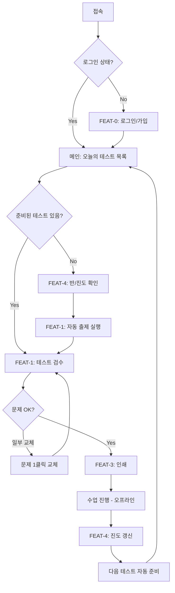
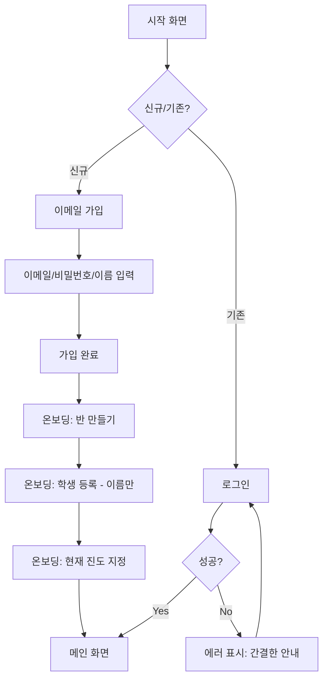
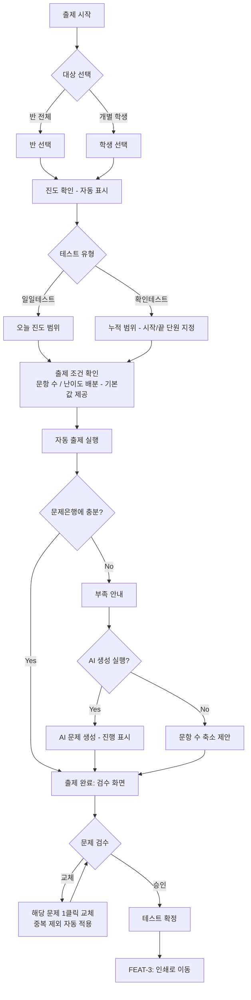
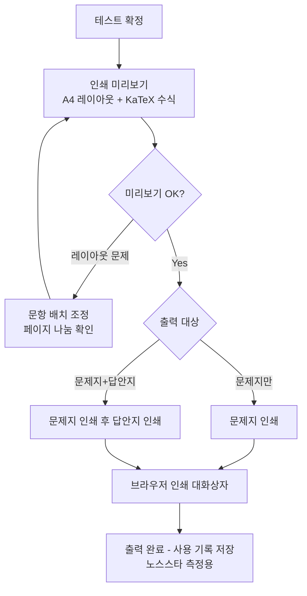
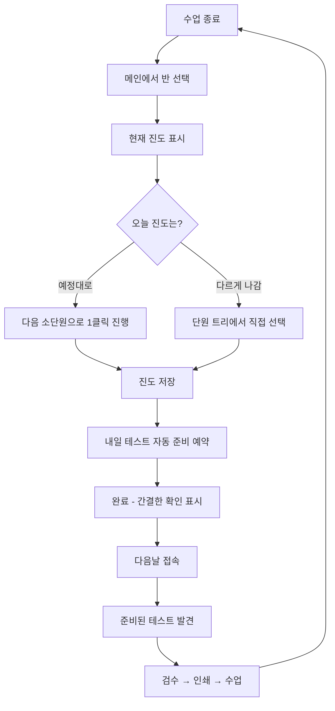
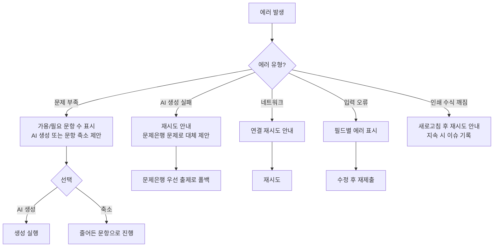

# User Flow (사용자 흐름도) — 오늘의수학

> Mermaid 플로우차트로 핵심 기능의 주요 여정을 표현합니다.
> 성공/실패 분기를 포함하고, 온보딩→핵심작업→리텐션 루프를 표현합니다.

---

## MVP 캡슐

| # | 항목 | 내용 |
|---|------|------|
| 1 | 목표 | 진도만 입력하면 수학 일일/확인테스트가 5분 안에 완성되어, 매일 30분~1시간을 되찾는다 |
| 2 | 페르소나 | 반별·학생별 진도가 다른 동네 수학학원 원장/강사 |
| 3 | 핵심 기능 | FEAT-1: 진도 기반 자동 출제 |
| 4 | 성공 지표 (노스스타) | 주 5일 이상 실제 사용 |
| 5 | 입력 지표 | ① 진도 입력→인쇄까지 5분 이내 ② 무수정 사용률 80% |
| 6 | 비기능 요구 | 수식이 깨지지 않는 A4 인쇄 품질 |
| 7 | Out-of-scope | 학생용 앱, 자동 채점, 모바일 앱, 결제 |
| 8 | Top 리스크 | AI 생성 문제 품질로 인한 검수 부담 |
| 9 | 완화/실험 | 검수 화면 1클릭 교체 + 무수정 사용률 측정 |
| 10 | 다음 단계 | /tasks-generator로 TASKS.md 생성 → Phase 0 시작 |

---

## 1. 전체 사용자 여정 (Overview)

핵심 루프: **진도 입력 → 자동 출제 → 검수 → 인쇄 → (수업) → 진도 갱신 → 다시 자동 출제**

---

## 2. FEAT-0: 온보딩/로그인 플로우

최초 가입 시 반·학생 등록까지가 온보딩입니다. 진도 데이터가 있어야 자동 출제가 가능하기 때문입니다.

---

## 3. FEAT-1: 진도 기반 자동 출제 플로우 (핵심)

**중복 방지 규칙**: 최근 N일(기본 14일) 내 같은 반/학생에게 출제된 문제는 자동 제외.

---

## 4. FEAT-3: 시험지 인쇄 플로우

---

## 5. FEAT-4: 진도 갱신 플로우 (리텐션 루프의 시작점)

수업 직후 10초 안에 끝나는 것이 목표입니다. 이 흐름이 매일 반복되어야 서비스가 삽니다.

---

## 6. 에러 처리 플로우

**에러 문구 원칙 (D-08 톤 적용)**: 간결하고 사무적으로. 원인 + 다음 행동 1개.
예: `"이 단원의 문제가 부족합니다. AI 생성을 실행하거나 문항 수를 줄여주세요."`

---

## 7. 화면 목록 (Screen Inventory)

| 화면 ID | 화면명 | FEAT | 진입점 | 주요 액션 |
|---------|--------|------|--------|----------|
| S-01 | 로그인/가입 | FEAT-0 | 최초 접속 | 이메일/비밀번호 로그인 (소셜 로그인 없음) |
| S-02 | 온보딩 (반/학생/진도 등록) | FEAT-0, 4 | 가입 직후 | 반 생성, 학생 등록, 진도 지정 |
| S-03 | 메인 (오늘의 테스트) | FEAT-1 | 로그인 후 | 준비된 테스트 확인, 출제 실행, 진도 갱신 |
| S-04 | 출제 설정 | FEAT-1, 2 | S-03 | 대상/유형/문항수/난이도 배분 |
| S-05 | 테스트 검수 | FEAT-1, 2 | S-04 | 문제 확인, 1클릭 교체, 확정 |
| S-06 | 인쇄 미리보기 | FEAT-3 | S-05 | A4 미리보기, 문제지/답안지 인쇄 |
| S-07 | 반/학생 관리 | FEAT-4 | 메뉴 | 반·학생 CRUD, 진도 트리 |
| S-08 | 문제은행 | FEAT-5 | 메뉴 | 문제 등록/조회, AI 생성, 변형 |

---

## Decision Log 참조 (UX/플로우 관련)

| ID | 항목 | 선택 | 근거 |
|----|------|------|------|
| D-05 | 사용 환경 | PC 웹 (프린터 연결) | 인쇄가 핵심 결과물 |
| D-07 | 디자인 방향 | 토스 느낌 + AI 공장식 배제, 사용자 주도 협업 | 사용자 명시 요구 |
| D-08 | 톤 | 간결·사무적 | 매일 쓰는 도구답게 |
| D-19 | 진도 입력 UX | 수업 직후 10초 내 완료 (1클릭 진행 기본) | 리스크 #3 (입력 습관) 완화 |
| D-20 | 중복 방지 | 최근 14일 출제 문제 자동 제외 | 학생이 답을 외우는 것 방지 |
