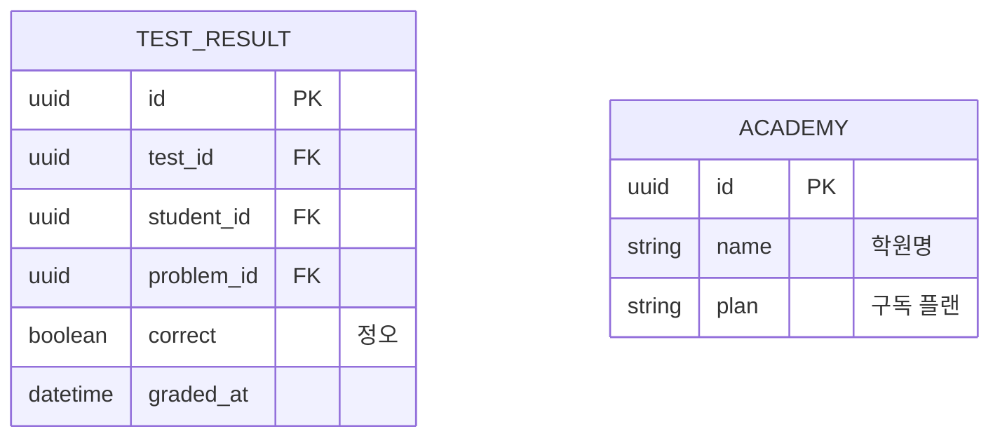

# Database Design (데이터베이스 설계) — 오늘의수학

> Mermaid ERD로 주요 엔티티와 관계를 표현합니다.
> 각 엔티티에 FEAT 주석을 달아 어떤 기능에서 사용되는지 명시합니다.
> 최소 수집 원칙을 반영하여 불필요한 개인정보는 지양합니다.

---

## MVP 캡슐

| # | 항목 | 내용 |
|---|------|------|
| 1 | 목표 | 진도만 입력하면 수학 일일/확인테스트가 5분 안에 완성되어, 매일 30분~1시간을 되찾는다 |
| 2 | 페르소나 | 반별·학생별 진도가 다른 동네 수학학원 원장/강사 |
| 3 | 핵심 기능 | FEAT-1: 진도 기반 자동 출제 |
| 4 | 성공 지표 (노스스타) | 주 5일 이상 실제 사용 |
| 5 | 입력 지표 | ① 진도 입력→인쇄까지 5분 이내 ② 무수정 사용률 80% |
| 6 | 비기능 요구 | 수식이 깨지지 않는 A4 인쇄 품질 |
| 7 | Out-of-scope | 학생용 앱, 자동 채점, 모바일 앱, 결제 |
| 8 | Top 리스크 | AI 생성 문제 품질로 인한 검수 부담 |
| 9 | 완화/실험 | 검수 화면 1클릭 교체 + 무수정 사용률 측정 |
| 10 | 다음 단계 | /tasks-generator로 TASKS.md 생성 → Phase 0 시작 |

---

## 1. ERD (Entity Relationship Diagram)

```mermaid
erDiagram
    %% FEAT-0: 사용자 (강사)
    USER {
        uuid id PK "고유 식별자"
        string email UK "로그인 이메일"
        string password_hash "이메일 가입 시 필수. NULL 허용은 과거 구글 가입자 잔존분 대비"
        string name "표시 이름"
        datetime created_at
        datetime updated_at
        datetime deleted_at "탈퇴 (soft delete)"
    }

    %% FEAT-4: 반
    CLASS {
        uuid id PK
        uuid user_id FK "담당 강사"
        string name "반 이름 (예: 중2-A)"
        string grade "학년 (예: 중2)"
        int default_problem_count "기본 문항 수 (기본 8)"
        jsonb difficulty_ratio "난이도 배분 (예: {easy:3, mid:4, hard:1})"
        datetime created_at
        datetime updated_at
    }

    %% FEAT-4: 학생
    STUDENT {
        uuid id PK
        uuid class_id FK "소속 반"
        string name "이름만 수집 (최소 수집 원칙)"
        boolean use_individual_progress "개별 진도 사용 여부"
        datetime created_at
        datetime updated_at
    }

    %% FEAT-1: 교육과정 단원 (기준 데이터)
    UNIT {
        uuid id PK
        string grade "학년 (중1~고3)"
        string chapter "대단원 (예: 일차함수)"
        string section "소단원 (예: 일차함수의 그래프)"
        int order_index "교육과정 순서 (진도 진행 기준)"
    }

    %% FEAT-4: 진도 기록
    PROGRESS {
        uuid id PK
        uuid class_id FK "반 진도"
        uuid student_id FK "개별 진도 (NULL이면 반 전체)"
        uuid unit_id FK "현재 진도 소단원"
        date recorded_at "기록일"
        datetime created_at
    }

    %% FEAT-1, 5: 문제은행
    PROBLEM {
        uuid id PK
        uuid user_id FK "소유자"
        uuid unit_id FK "단원"
        string source "출처: manual | past_exam | transformed | ai_generated"
        uuid origin_problem_id FK "변형 시 원본 문제 (NULL 가능)"
        string difficulty "난이도: easy | mid | hard"
        string problem_type "유형: 계산 | 개념 | 활용 | 서술형"
        text content "문제 본문 (LaTeX 포함 마크다운)"
        text answer "정답"
        text solution "풀이"
        string review_status "검수 상태: pending | approved | rejected"
        datetime created_at
        datetime updated_at
    }

    %% FEAT-1: 시험지
    TEST {
        uuid id PK
        uuid user_id FK "출제자"
        uuid class_id FK "대상 반"
        uuid student_id FK "개별 대상 (NULL이면 반 전체)"
        string test_type "유형: daily | review"
        uuid range_start_unit_id FK "범위 시작 (확인테스트용)"
        uuid range_end_unit_id FK "범위 끝"
        string status "상태: draft | confirmed | printed"
        boolean modified "검수 중 교체 발생 여부 (무수정 사용률 측정)"
        date test_date "테스트 예정일"
        datetime printed_at "인쇄 시각 (노스스타 측정)"
        datetime created_at
    }

    %% FEAT-1: 시험지-문제 연결
    TEST_PROBLEM {
        uuid id PK
        uuid test_id FK
        uuid problem_id FK
        int order_index "문항 번호"
        boolean replaced "교체된 문항 여부"
    }

    %% 관계 정의
    USER ||--o{ CLASS : "담당"
    USER ||--o{ PROBLEM : "소유"
    USER ||--o{ TEST : "출제"
    CLASS ||--o{ STUDENT : "소속"
    CLASS ||--o{ PROGRESS : "진도 기록"
    STUDENT ||--o{ PROGRESS : "개별 진도"
    UNIT ||--o{ PROGRESS : "기준"
    UNIT ||--o{ PROBLEM : "분류"
    PROBLEM ||--o{ PROBLEM : "변형 원본"
    CLASS ||--o{ TEST : "대상"
    TEST ||--o{ TEST_PROBLEM : "구성"
    PROBLEM ||--o{ TEST_PROBLEM : "포함"
```

---

## 2. 엔티티 상세 정의

### 2.1 USER (강사) - FEAT-0

| 컬럼 | 타입 | 제약조건 | 설명 |
|------|------|----------|------|
| id | UUID | PK | 고유 식별자 |
| email | VARCHAR(255) | UNIQUE, NOT NULL | 로그인 이메일 |
| password_hash | VARCHAR(255) | NULL 허용 | 소셜 로그인 제거(2026-08-14) 후 신규 가입은 항상 값이 있다. NULL 허용은 과거 구글 가입자 잔존분 대비 — 이런 레코드는 로그인 불가 |
| name | VARCHAR(50) | NOT NULL | 표시 이름 |
| created_at | TIMESTAMP | NOT NULL, DEFAULT NOW() | 가입일 |
| updated_at | TIMESTAMP | NOT NULL | 최종 수정일 |
| deleted_at | TIMESTAMP | NULL | Soft delete용 |

**최소 수집 원칙 적용:**
- 필수: email, name
- 수집 안 함: 전화번호, 주소, 생년월일

### 2.2 UNIT (교육과정 단원) - FEAT-1 기준 데이터

| 컬럼 | 타입 | 제약조건 | 설명 |
|------|------|----------|------|
| id | UUID | PK | 고유 식별자 |
| grade | VARCHAR(10) | NOT NULL | 학년 (중1~고3) |
| chapter | VARCHAR(100) | NOT NULL | 대단원 |
| section | VARCHAR(100) | NOT NULL | 소단원 |
| order_index | INT | NOT NULL | 교육과정 순서 — 진도 "다음으로" 이동과 확인테스트 범위 계산의 기준 |

**시드 데이터**: 한국 수학 교육과정(중1~고3) 단원 트리를 초기 시드로 투입.
`order_index`가 진도의 "앞/뒤"를 결정하므로 교육과정 순서와 정확히 일치해야 함.

**인덱스:**
- `idx_unit_grade_order` ON (grade, order_index)

### 2.3 PROBLEM (문제은행) - FEAT-1, FEAT-5

| 컬럼 | 타입 | 제약조건 | 설명 |
|------|------|----------|------|
| id | UUID | PK | 고유 식별자 |
| user_id | UUID | FK → USER.id, NOT NULL | 소유자 |
| unit_id | UUID | FK → UNIT.id, NOT NULL | 단원 분류 |
| source | VARCHAR(20) | NOT NULL | `manual`(자작) / `past_exam`(기출) / `transformed`(변형) / `ai_generated`(AI 생성) |
| origin_problem_id | UUID | FK → PROBLEM.id, NULL | 변형 문제의 원본 참조 |
| difficulty | VARCHAR(10) | NOT NULL | `easy` / `mid` / `hard` |
| problem_type | VARCHAR(20) | NOT NULL | `계산` / `개념` / `활용` / `서술형` |
| content | TEXT | NOT NULL | 문제 본문 — LaTeX 수식 포함 (`$...$` 표기) |
| answer | TEXT | NOT NULL | 정답 |
| solution | TEXT | NULL | 풀이 |
| review_status | VARCHAR(10) | NOT NULL, DEFAULT 'pending' | AI 생성물은 `pending`으로 시작, 검수 후 `approved` |
| direct_use_allowed | BOOLEAN | NOT NULL, DEFAULT true | RPM 원본은 false (D-26). 출제 풀에서 제외 |
| pool | VARCHAR(10) | NOT NULL, DEFAULT 'shared' | `shared`(공용) / `private`(소유자만). 기본 공용 (D-31) |
| created_at | TIMESTAMP | NOT NULL, DEFAULT NOW() | 생성일 |
| updated_at | TIMESTAMP | NOT NULL | 수정일 |

**출제 규칙**: 자동 출제는 `review_status = 'approved'` 이고 `direct_use_allowed = true` 이며 `pool = shared` 또는 본인 `private`인 문제만 사용.
`pending`(미검수 AI 생성물)은 시험지 검수 화면에서 함께 검수되면 `approved`로 승격.

**인덱스:**
- `idx_problem_user_unit` ON (user_id, unit_id)
- `idx_problem_selection` ON (unit_id, difficulty, review_status, direct_use_allowed) — 자동 출제 조회 최적화
- `idx_problem_pool_selection` ON (pool, unit_id, review_status, direct_use_allowed) — 공용 풀 조회 (D-31)

### 2.4 TEST (시험지) - FEAT-1

| 컬럼 | 타입 | 제약조건 | 설명 |
|------|------|----------|------|
| id | UUID | PK | 고유 식별자 |
| user_id | UUID | FK → USER.id, NOT NULL | 출제자 |
| class_id | UUID | FK → CLASS.id, NOT NULL | 대상 반 |
| student_id | UUID | FK → STUDENT.id, NULL | 개별 학생 대상 시 (NULL = 반 전체) |
| test_type | VARCHAR(10) | NOT NULL | `daily`(일일) / `review`(확인) |
| range_start_unit_id | UUID | FK → UNIT.id, NULL | 확인테스트 범위 시작 |
| range_end_unit_id | UUID | FK → UNIT.id, NOT NULL | 범위 끝 (일일테스트는 현재 진도) |
| status | VARCHAR(10) | NOT NULL, DEFAULT 'draft' | `draft` → `confirmed` → `printed` |
| modified | BOOLEAN | NOT NULL, DEFAULT false | 검수 중 문제 교체 발생 여부 — **무수정 사용률 측정** |
| test_date | DATE | NOT NULL | 테스트 예정일 |
| printed_at | TIMESTAMP | NULL | 인쇄 시각 — **노스스타(주 5일 사용) 측정** |
| created_at | TIMESTAMP | NOT NULL, DEFAULT NOW() | 생성일 |

**인덱스:**
- `idx_test_user_date` ON (user_id, test_date DESC)
- `idx_test_class` ON (class_id, test_date DESC)

### 2.5 TEST_PROBLEM (시험지-문제 연결) - FEAT-1

| 컬럼 | 타입 | 제약조건 | 설명 |
|------|------|----------|------|
| id | UUID | PK | 고유 식별자 |
| test_id | UUID | FK → TEST.id, NOT NULL | 시험지 |
| problem_id | UUID | FK → PROBLEM.id, NOT NULL | 문제 |
| order_index | INT | NOT NULL | 문항 번호 |
| replaced | BOOLEAN | NOT NULL, DEFAULT false | 검수 중 교체된 문항 표시 |

**중복 방지 쿼리 기반**: "최근 14일 내 이 반/학생의 TEST에 포함된 problem_id 제외"가
이 테이블 JOIN으로 계산됨.

**인덱스:**
- `idx_tp_test` ON (test_id, order_index)
- `idx_tp_problem` ON (problem_id) — 중복 방지 조회용

### 2.6 CLASS / STUDENT / PROGRESS - FEAT-4

**CLASS**: 반 이름, 학년, 출제 기본값(문항 수, 난이도 배분 jsonb)을 보유.
난이도 배분 기본값 `{easy: 3, mid: 4, hard: 1}` (8문항 기준) — 반 수준에 따라 조절 가능.

**STUDENT**: 이름만 수집. `use_individual_progress = true`면 반 진도 대신 개별 진도 적용.

**PROGRESS**: 진도 기록의 누적 이력 (최신 1건이 현재 진도).
- `student_id IS NULL` → 반 전체 진도
- `student_id` 있음 → 해당 학생 개별 진도 (반 진도보다 우선)

**인덱스:**
- `idx_progress_class` ON (class_id, recorded_at DESC)
- `idx_progress_student` ON (student_id, recorded_at DESC)

---

## 3. 관계 정의

| 부모 | 자식 | 관계 | 설명 |
|------|------|------|------|
| USER | CLASS | 1:N | 강사는 여러 반 담당 |
| CLASS | STUDENT | 1:N | 반에 여러 학생 소속 |
| CLASS/STUDENT | PROGRESS | 1:N | 진도는 이력으로 누적 (최신이 현재) |
| UNIT | PROBLEM | 1:N | 문제는 소단원에 분류됨 |
| PROBLEM | PROBLEM | 1:N (self) | 변형 문제 → 원본 추적 (`origin_problem_id`) |
| USER | PROBLEM | 1:N | 등록자 기록. 조회는 공용 풀 + 본인 private (D-31) |
| TEST | TEST_PROBLEM | 1:N | 시험지는 문항 순서를 가진 문제 목록 |
| PROBLEM | TEST_PROBLEM | 1:N | 한 문제는 여러 시험지에 사용 가능 (중복 방지 규칙 하에) |

---

## 4. 데이터 생명주기

| 엔티티 | 생성 시점 | 보존 기간 | 삭제/익명화 |
|--------|----------|----------|------------|
| USER | 회원가입 | 탈퇴 후 30일 | Hard delete |
| CLASS/STUDENT | 온보딩·운영 중 | 삭제 시 즉시 | Cascade delete |
| PROGRESS | 진도 입력 | 계정과 동일 | Cascade delete |
| PROBLEM | 등록/생성 | 영구 (사용자 자산) | 계정 삭제 시 함께 삭제 |
| TEST / TEST_PROBLEM | 출제 시 | 2년 | Hard delete (기간 경과 배치) |

---

## 5. 확장 고려사항

### 5.1 v2에서 추가 예정 엔티티



**판매 확장 경로**: 현재 `user_id` 격리 구조에서 `academy_id`를 상위에 추가하는 방식.
MVP에서는 만들지 않되, 모든 소유권이 `user_id`로 일관되게 걸려 있어 이전 비용이 낮음.

### 5.2 인덱스 전략

- **읽기 최적화**: 자동 출제 조회 `(unit_id, difficulty, review_status)` 복합 인덱스가 핵심
- **쓰기 고려**: 인덱스 과다 방지 — MVP 트래픽에서는 위 목록으로 충분
- **중복 방지**: TEST_PROBLEM의 problem_id 인덱스로 최근 출제 이력 JOIN 최적화

---

## Decision Log 참조 (데이터 관련)

| ID | 항목 | 선택 | 근거 |
|----|------|------|------|
| D-04 | 문제 출처 | source 컬럼 4종 (manual/past_exam/transformed/ai_generated) + 원본 추적 | 출처별 관리·저작권 추적 가능 |
| D-06 | 저장 | 클라우드 PostgreSQL | 기기 무관 접근 |
| D-14 | DB | PostgreSQL (Supabase/Neon) | 관계형 데이터 적합 |
| D-20 | 중복 방지 | TEST_PROBLEM 이력 기반 최근 14일 제외 | 답 암기 방지 |
| D-21 | 진도 모델 | PROGRESS 이력 누적 + 반/개별 이중 구조 | 학생별 진도 차이 지원 (Q4) |
| D-22 | AI 생성물 검수 | review_status로 pending→approved 승격 | 품질 리스크 #1 완화 |
| D-26 | RPM 잠금 | direct_use_allowed=false | 원본 직접 출제 금지, 변형 원본만 |
| D-31 | 공용 풀 | pool 기본 shared. 조회는 공용+본인 private | 원장님: 지시 없으면 전부 공용 |
