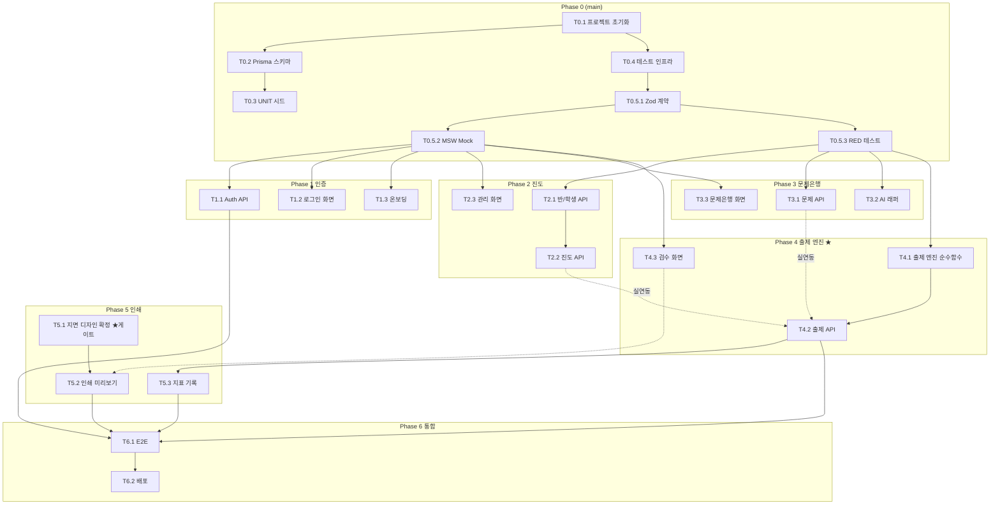

# TASKS: 오늘의수학 - AI 개발 파트너용 태스크 목록

> 이 문서는 오케스트레이터와 서브 에이전트가 사용하는 실행 계획입니다.
> Phase 0 = main 브랜치 직접 작업 / Phase 1+ = Git Worktree 필수 + TDD (RED→GREEN→REFACTOR)

---

## MVP 캡슐

1. 목표: 진도만 입력하면 수학 일일/확인테스트가 5분 안에 완성되어, 매일 30분~1시간을 되찾는다
2. 페르소나: 반별·학생별 진도가 다른 동네 수학학원 원장/강사
3. 핵심 기능: FEAT-1 진도 기반 자동 출제
4. 성공 지표 (노스스타): 주 5일 이상 실제 사용
5. 입력 지표: ① 진도 입력→인쇄까지 5분 이내 ② 무수정 사용률 80%
6. 비기능 요구: 수식이 깨지지 않는 A4 인쇄 품질
7. Out-of-scope: 학생용 앱, 자동 채점, 모바일 앱, 결제
8. Top 리스크: AI 생성 문제 품질로 인한 검수 부담
9. 완화/실험: 검수 화면 1클릭 교체 + 무수정 사용률 측정
10. 다음 단계: M0 프로젝트 셋업부터 순차 실행

---

## 기술 스택 (TRD 확정)

| 항목 | 선택 |
|------|------|
| 프레임워크 | Next.js 15+ (App Router) 풀스택 단독, TypeScript |
| 스타일링 | Tailwind CSS v4 — 기성 컴포넌트 킷 금지 (D-15) |
| DB/ORM | PostgreSQL (Supabase/Neon) + Prisma |
| 검증/계약 | Zod (`src/contracts/` = SSOT) |
| 인증 | Auth.js (NextAuth v5) — 이메일/구글 |
| AI | Claude API (`@anthropic-ai/sdk`) — 테스트에서는 항상 MSW 모킹 |
| 수식/인쇄 | KaTeX + 브라우저 인쇄 CSS |
| 테스트 | Vitest + RTL + MSW + Playwright |

**⚠️ UI 태스크 공통 게이트 (D-23, D-30)**: 화면 구현 전 `05-design-system.md`에서 해당 화면이
`[확정]`인지 확인. `[협의 필요]`면 시안 제시 → 원장님 확정 후 구현 착수.
클릭되지 않는 카드/행에 `cursor-pointer`·행 hover를 두면 D-30 검사가 커밋을 막는다.

---

## 자산 이관 전략 (2026-08-13 확정 — D-25, D-26)

기존 프로젝트 탐색 결과, 아래 자산을 이관한다. 신규 개발 태스크는 "이식+검증"으로 성격이 바뀐다.
상세 위치는 메모리 `legacy-asset-map` 및 각 프로젝트 문서 참조.

| 이관 자산 | 출처 | 반영 태스크 |
|-----------|------|------------|
| 교육과정 트리 초1~고3 (171노드) + 중고 3단 트리(대38/중76/소단원) + 초등 세분화 282개념 | `F:\mathlab\src\lib\constants\curriculum.ts` + `F:\math-report\...\upload-form\constants.ts` + `F:\math_test\backend\app\data\pdf_concept_map.py` | T0.3 |
| 기출 문항 3,094 (LaTeX+정답 2,484+서술형 해설) | `F:\시험지변환기\db\ocr_pilot\*.json` (⚠️ `db\extracted`는 HWP-EQ라 사용 금지) | T3.0 (신설) |
| 자작 시드 문항 ~753 (초3~고2, LaTeX+해설+힌트) | `F:\math_test\backend\app\seeds\` | T3.0 (신설) |
| RPM 5,035문항 — **원본도 이관하되 직접 출제 잠금, 앱 내 변형의 원본 전용 (D-26)** | sumaek Supabase (읽기 전용 SELECT로 추출) | T3.0 — `directUseAllowed=false`로 적재, 변형본만 출제 풀 진입 |
| 변형 엔진 설계 (parse/solve/render/vary/check 분리 + 원본 재현 검사) | `C:\Creative\sumaek\packages\core\src\variants\` | T3.2 |
| 출제 엔진 참조 구현 (결정론적 버킷, shortfall 보고) | `C:\Creative\sumaek\packages\core\src\assessment\select.ts` + `F:\mathlab-lab-p1\...\smart-prescriber.ts` | T4.1 |
| KaTeX 3단 방어 렌더 + 한국 수학 정규화 47KB | `F:\Mathgen\src\lib\katexRender.ts` + `textPreprocess.ts` | T3.3 |
| **결정론적 SVG 도형 엔진** (2D 접선/각라벨 검산 + 3D 공간도형 `figure_solid` + `sanitize_svg`) | `F:\시험지변환기\core\figure_svg.py` + `figure_solid.py` + `figure_quality.py` (origin/master `d95a6be`, 2026-08-14 pull) | T3.0 그림 자산 · T5.2 작도. KaTeX와 계층이 다름 — 수식 렌더에 섞지 말 것 |
| **A4 인쇄 엔진 일체** (템플릿 6종, 실측 높이 페이지 패킹, PDF 내보내기, 정답지) | `F:\Mathgen\src\components\print\` + `src\lib\printPack.ts` 등 | T5.2 |
| 지뢰 문서 3종 (필독) | sumaek `docs\handoff.md` / mathlab-lab-p1 `docs\lab\HANDOFF.md` / Mathgen `CLAUDE.md` | 관련 태스크 착수 전 |

**이관 원칙**:
1. 코드는 복사 후 이 프로젝트 컨벤션(07 문서)에 맞춰 정리 — 원본 저장소는 절대 수정하지 않는다
2. mathlab 라이브 Supabase에는 **읽기 접근도 신중히** — 스키마/데이터 변경 절대 금지
3. 이식 코드도 TDD 게이트 동일 적용 — 기존 테스트가 없으면 이식과 동시에 테스트 작성

---

## 마일스톤 개요

| 마일스톤 | Phase | 설명 | 주요 기능 |
|----------|-------|------|----------|
| M0 | Phase 0 | 프로젝트 셋업 | git init, Next.js, Prisma, 시드, 테스트 인프라 |
| M0.5 | Phase 0 | 계약 & 테스트 설계 | Zod 계약, MSW Mock, RED 테스트 |
| M1 | Phase 1 | FEAT-0 인증/온보딩 | 로그인, 가입, 온보딩 |
| M2 | Phase 2 | FEAT-4 반/학생/진도 관리 | CRUD + 진도 이력 |
| M3 | Phase 3 | FEAT-5 문제은행 | 등록, AI 생성/변형 |
| M4 | Phase 4 | FEAT-1+2 출제 엔진 (심장) | 자동 출제 + 난이도 균형 + 중복 방지 |
| M5 | Phase 5 | FEAT-3 시험지 인쇄 | 지면 디자인, 미리보기, 인쇄, 지표 기록 |
| M6 | Phase 6 | 통합 검증 | E2E, 실물 인쇄 검수, 배포 |

---

## M0: 프로젝트 셋업 (Phase 0 — main 직접 작업)

### [x] Phase 0, T0.1: Git 저장소 + Next.js 프로젝트 초기화

**담당**: frontend-specialist

**작업 내용**:
- `git init` (현재 저장소 아님 — 최초 1회)
- Next.js 15+ 프로젝트 생성 (TypeScript, App Router, Tailwind CSS, ESLint)
- Prettier + husky + lint-staged 설정
- `.env.example` 작성 (DATABASE_URL, AUTH_SECRET, GOOGLE_CLIENT_ID/SECRET, ANTHROPIC_API_KEY)
- 디렉토리 골격 생성: `src/contracts/`, `src/lib/generator/`, `src/lib/ai/prompts/`, `src/components/`, `src/mocks/`, `src/__tests__/`, `e2e/`

**산출물**:
- Next.js 프로젝트 루트 일식, `.env.example`, `.gitignore`

**완료 조건**:
- [ ] `npm run dev` 정상 구동
- [ ] `npm run lint` / `npm run type-check` 통과
- [ ] 최초 커밋 완료

### [x] Phase 0, T0.2: Prisma 스키마 + DB 연결

**담당**: database-specialist

**작업 내용**:
- `04-database-design.md`의 9개 엔티티를 `prisma/schema.prisma`로 구현
  (User, Class, Student, Unit, Progress, Problem, Test, TestProblem + Auth.js 요구 테이블)
- 인덱스 정의 (특히 `(unit_id, difficulty, review_status)` 출제 조회 최적화)
- Supabase 또는 Neon 무료 인스턴스 연결, 첫 마이그레이션 실행

**산출물**:
- `prisma/schema.prisma`, 마이그레이션 파일

**완료 조건**:
- [ ] `npx prisma migrate dev` 성공
- [ ] `npx prisma studio`에서 전체 테이블 확인

### [x] Phase 0, T0.3: UNIT 교육과정 시드 데이터 (기존 자산 이관)

**담당**: database-specialist

**작업 내용**:
- **기존 자산 3종을 통합**하여 `prisma/seed.ts` 작성 (신규 작성 아님 — 이관·통합):
  - 골격: `F:\mathlab\src\lib\constants\curriculum.ts` (초1~고3, 25학기, 171노드 — **초등 포함 요구 충족**)
  - 중고 소단원 세분화: `F:\math-report\frontend\src\components\exam\upload-form\constants.ts`의 `CURRICULUM_HIERARCHY` (대38/중76/소단원)
  - 초등 세분화 보강: `F:\math_test\backend\app\data\pdf_concept_map.py` (초3~초6, 282개념)
- Unit 스키마 매핑: grade(학년/학기 블록) + chapter(대단원) + section(소단원)
- `orderIndex`는 **전역 연속값** 채택 (T0.2 권장안 — 확인테스트 범위와 "다음 소단원" 이동이 학년 경계를 넘을 수 있음)
- 원본 파일은 절대 수정하지 않음 (읽기 전용 참조)

**산출물**:
- `prisma/seed.ts`, `package.json`의 prisma.seed 설정

**완료 조건**:
- [ ] `npx prisma db seed` 성공 (DB 마이그레이션 완료 후)
- [ ] 초1~고3 전 범위 커버 확인 (블록 수/노드 수 검증)
- [ ] 원장님이 단원 트리 표기(교재 용어와 일치 여부) 확인

### [x] Phase 0, T0.4: 테스트 인프라 구축

**담당**: test-specialist

**작업 내용**:
- Vitest + React Testing Library 설정 (`vitest.config.ts`)
- MSW 설정 (`src/mocks/server.ts`)
- Playwright 설정 (`playwright.config.ts`)
- 테스트 전용 DB 스키마/환경 분리
- 커버리지 리포트 설정 (목표 80%)

**산출물**:
- `vitest.config.ts`, `playwright.config.ts`, `src/mocks/server.ts`, 샘플 테스트 1개

**완료 조건**:
- [ ] `npm run test` 샘플 테스트 통과
- [ ] `npx playwright test` 구동 확인

---

## M0.5: 계약 & 테스트 설계 (Phase 0 — main 직접 작업)

### [x] Phase 0, T0.5.1: Zod 계약 정의 (API SSOT)

**담당**: backend-specialist

**작업 내용**:
- `src/contracts/auth.contract.ts` — 가입/로그인 요청·응답
- `src/contracts/class.contract.ts` — 반/학생/진도 CRUD
- `src/contracts/problem.contract.ts` — 문제 등록/조회/AI 생성/변형
- `src/contracts/test.contract.ts` — 출제 요청(대상/유형/문항수/난이도배분)·검수·교체·확정
- 공통 에러 응답 스키마 (`INSUFFICIENT_PROBLEMS` 등 에러 코드 포함)

**산출물**:
- `src/contracts/*.contract.ts` (Zod 스키마 + `z.infer` 타입 export)

**완료 조건**:
- [ ] `03-user-flow.md`의 8개 화면이 필요로 하는 API가 계약으로 모두 커버됨
- [ ] `npm run type-check` 통과

### [x] Phase 0, T0.5.2: MSW Mock 핸들러 + Mock 데이터

**담당**: test-specialist

**작업 내용**:
- 계약 기반 MSW 핸들러: `src/mocks/handlers/{auth,class,problem,test}.ts`
- **Claude API Mock**: 문제 생성/변형 응답 고정 픽스처 (`src/mocks/data/aiProblems.ts`)
- Mock 데이터: 반 2개, 학생 5명, 문제 30개(난이도/유형 분포), 진도 기록

**산출물**:
- `src/mocks/handlers/*.ts`, `src/mocks/data/*.ts`

**완료 조건**:
- [ ] 모든 핸들러 응답이 Zod 계약 파싱 통과
- [ ] 화면 개발이 실제 API 없이 가능한 상태

### [x] Phase 0, T0.5.3: RED 테스트 선행 작성

**담당**: test-specialist

**작업 내용**:
- API 테스트 뼈대: `src/__tests__/api/{auth,class,problem,test}.test.ts` — 계약 기반, 전부 실패(RED) 상태
- 출제 엔진 단위 테스트: `src/__tests__/unit/generator.test.ts`
  - 난이도 배분 (예: 8문항 = easy 3 / mid 4 / hard 1)
  - 최근 14일 중복 제외 (D-20)
  - 확인테스트 범위 계산 (order_index 기반)
  - 문제 부족 시 폴백 (INSUFFICIENT_PROBLEMS)
- 수식 렌더링 테스트 케이스: 분수·루트·지수·도형 기호

**산출물**:
- `src/__tests__/api/*.test.ts`, `src/__tests__/unit/generator.test.ts` (모두 RED)

**완료 조건**:
- [ ] `npm run test` 실행 시 전부 FAILED (RED 정상 확인)
- [ ] 각 테스트가 참조하는 계약과 1:1 매칭

---

## M1: FEAT-0 인증/온보딩 (Phase 1 — Worktree 필수)

### [x] Phase 1, T1.1: Auth.js 인증 API RED→GREEN

**담당**: backend-specialist

**Git Worktree 설정**:
```bash
git worktree add ../testautocreator-phase1-auth -b phase/1-auth
cd ../testautocreator-phase1-auth
# 작업 완료 후 병합 (사용자 승인 필요)
# git checkout main && git merge phase/1-auth
# git worktree remove ../testautocreator-phase1-auth
```

**TDD 사이클**:
1. **RED**: `src/__tests__/api/auth.test.ts` 확인
   ```bash
   npm run test -- src/__tests__/api/auth.test.ts   # Expected: FAILED
   ```
2. **GREEN**: Auth.js 설정 + 이메일 가입(bcrypt) + 구글 Provider
   - 구현: `src/app/api/auth/[...nextauth]/route.ts`, `src/lib/auth.ts`
   ```bash
   npm run test -- src/__tests__/api/auth.test.ts   # Expected: PASSED
   ```
3. **REFACTOR**: 세션 헬퍼(`getSessionUser`) 추출 — 이후 모든 API의 소유권 검증에 재사용

**산출물**:
- `src/lib/auth.ts`, `src/app/api/auth/**` (구현) / `src/__tests__/api/auth.test.ts` (테스트)

**인수 조건**:
- [ ] 테스트 먼저 작성됨 (RED 확인)
- [ ] 모든 테스트 통과 (GREEN)
- [ ] 커버리지 ≥ 80%
- [ ] API 키/시크릿이 코드에 하드코딩되지 않음

**완료 시**:
- [ ] 사용자 승인 후 main 병합, worktree 정리

### [x] Phase 1, T1.2: 로그인/가입 화면 (S-01) RED→GREEN

**담당**: frontend-specialist
**의존성**: T1.1 — **MSW auth 핸들러로 독립 개발 가능**
**⚠️ 디자인 게이트**: 시안 제시 → 원장님 확정 후 구현 (D-23)

**Git Worktree 설정**:
```bash
git worktree add ../testautocreator-phase1-auth-ui -b phase/1-auth-ui
cd ../testautocreator-phase1-auth-ui
```

**TDD 사이클**:
1. **RED**: `src/__tests__/components/LoginForm.test.tsx` 작성
   ```bash
   npm run test -- src/__tests__/components/LoginForm.test.tsx   # FAILED
   ```
2. **GREEN**: `src/app/(auth)/login/page.tsx`, `src/components/auth/LoginForm.tsx`
   ```bash
   npm run test -- src/__tests__/components/LoginForm.test.tsx   # PASSED
   ```
3. **REFACTOR**: 공용 Input/Button 컴포넌트 추출 (`src/components/ui/` — 직접 제작)

**산출물**: 위 테스트/구현 파일

**인수 조건**:
- [ ] RED→GREEN 확인, 커버리지 ≥ 80%
- [ ] 톤 규칙 준수 — 간결·사무적 문구 (D-08)
- [ ] AI 공장식 금지 목록 위반 없음 (05 문서 섹션 0)

**완료 시**:
- [ ] 사용자 승인 후 main 병합, worktree 정리

### [x] Phase 1, T1.3: 온보딩 플로우 (S-02) RED→GREEN

**담당**: frontend-specialist
**의존성**: T2.1(반/학생 API) — **MSW class 핸들러로 독립 개발 가능**
**⚠️ 디자인 게이트**: 시안 확정 후 구현

**Git Worktree 설정**:
```bash
git worktree add ../testautocreator-phase1-onboarding -b phase/1-onboarding
cd ../testautocreator-phase1-onboarding
```

**TDD 사이클**:
1. **RED**: `src/__tests__/components/Onboarding.test.tsx` — 반 생성→학생 등록→진도 지정 3단계 흐름
2. **GREEN**: `src/app/(auth)/onboarding/page.tsx`, `src/components/onboarding/*`
3. **REFACTOR**: 진도 트리 선택기를 `src/components/progress/UnitTreePicker.tsx`로 분리 (S-07에서 재사용)

**테스트 명령어**: `npm run test -- src/__tests__/components/Onboarding.test.tsx`

**산출물**: 위 테스트/구현 파일

**인수 조건**:
- [ ] RED→GREEN 확인, 커버리지 ≥ 80%
- [ ] 온보딩 완료 시 메인(S-03) 진입 가능 상태

**완료 시**:
- [ ] 사용자 승인 후 main 병합, worktree 정리

---

## M2: FEAT-4 반/학생/진도 관리 (Phase 2 — Worktree 필수)

### [x] Phase 2, T2.1: 반/학생 CRUD API RED→GREEN

**담당**: backend-specialist

**Git Worktree 설정**:
```bash
git worktree add ../testautocreator-phase2-class -b phase/2-class
cd ../testautocreator-phase2-class
```

**TDD 사이클**:
1. **RED**: `src/__tests__/api/class.test.ts`
   ```bash
   npm run test -- src/__tests__/api/class.test.ts   # FAILED
   ```
2. **GREEN**: `src/app/api/classes/**`, `src/app/api/students/**` — Zod 검증 + user_id 소유권 검증
3. **REFACTOR**: 소유권 검증 미들웨어 패턴 통일

**산출물**: 위 테스트/구현 파일

**인수 조건**:
- [ ] RED→GREEN, 커버리지 ≥ 80%
- [ ] 타 사용자 데이터 접근 시 403 테스트 포함
- [ ] 학생은 이름만 수집 (최소 수집 원칙)

**완료 시**:
- [ ] 사용자 승인 후 main 병합, worktree 정리

### [x] Phase 2, T2.2: 진도 기록/조회 API RED→GREEN

**담당**: backend-specialist

**Git Worktree 설정**:
```bash
git worktree add ../testautocreator-phase2-progress -b phase/2-progress
cd ../testautocreator-phase2-progress
```

**TDD 사이클**:
1. **RED**: `src/__tests__/api/progress.test.ts`
   - 반 진도 기록/최신 조회, 개별 진도 우선 적용(use_individual_progress), 이력 누적
2. **GREEN**: `src/app/api/progress/**`, `src/lib/progressResolver.ts` (반/개별 이중 구조 해석 — 순수 함수)
3. **REFACTOR**: 출제 엔진(T4.1)이 쓸 `getCurrentProgress()` 인터페이스 확정

**테스트 명령어**: `npm run test -- src/__tests__/api/progress.test.ts`

**산출물**: 위 테스트/구현 파일

**인수 조건**:
- [ ] RED→GREEN, 커버리지 ≥ 80%
- [ ] "다음 소단원 1클릭 진행"용 API (order_index 기반) 포함 (D-19)

**완료 시**:
- [ ] 사용자 승인 후 main 병합, worktree 정리

### [x] Phase 2, T2.3: 반/학생 관리 화면 (S-07) RED→GREEN

**담당**: frontend-specialist
**의존성**: T2.1, T2.2 — **MSW 핸들러로 독립 개발 가능**
**⚠️ 디자인 게이트**: 진도 트리 선택기 UX는 `[협의 필요]` — 시안 확정 후 구현 (10초 입력 목표, D-19)

**Git Worktree 설정**:
```bash
git worktree add ../testautocreator-phase2-class-ui -b phase/2-class-ui
cd ../testautocreator-phase2-class-ui
```

**TDD 사이클**:
1. **RED**: `src/__tests__/components/ClassManage.test.tsx`, `UnitTreePicker.test.tsx`
2. **GREEN**: `src/app/(main)/classes/page.tsx`, `src/components/progress/UnitTreePicker.tsx`
3. **REFACTOR**: 트리 데이터 로딩 훅 분리

**테스트 명령어**: `npm run test -- src/__tests__/components/ClassManage.test.tsx`

**산출물**: 위 테스트/구현 파일

**인수 조건**:
- [ ] RED→GREEN, 커버리지 ≥ 80%
- [ ] 진도 갱신이 3클릭 이내(1클릭 진행 기본)로 완료

**완료 시**:
- [ ] 사용자 승인 후 main 병합, worktree 정리

---

## M3: FEAT-5 문제은행 (Phase 3 — Worktree 필수)

### [] Phase 3, T3.0: 기존 문제 데이터 이관 (신설 — 자산 이관) — 컨버터/dry-run GREEN, 공용 풀 적재는 ALLOW_SHARED_IMPORT=1

**담당**: database-specialist

**Git Worktree 설정**:
```bash
git worktree add ../testautocreator-phase3-import -b phase/3-import
cd ../testautocreator-phase3-import
```

**선행 조건**: 스키마 보강 마이그레이션 — `Problem.directUseAllowed Boolean @default(true)` 추가
(RPM 원본 잠금용, D-26)

**작업 내용** (3개 소스 → Prisma 적재 컨버터 작성):
1. **기출 3,094문항**: `F:\시험지변환기\db\ocr_pilot\*.json` (본문) + `*.answers.json` (정답)
   - ContentBlock 구조(text/equation/table/figure) → 우리 content(LaTeX 마크다운) 변환
   - source=`past_exam`, directUseAllowed=true
   - ⚠️ figure 블록은 크롭 이미지 또는 **재작도 SVG** — 재작도는 `core/figure_svg`+`figure_solid`만 사용하고 `figure_quality.sanitize_svg`를 통과한 것만 적재. 라벨·접선은 손으로 좌표를 찍지 말 것(핸드오프 `docs/HANDOFF_FIGURE_ENGINE.md`)
   - ⚠️ `db\extracted\*.json`(HWP-EQ 표기)은 사용 금지. HWP 수식이 들어오면 `core/hwpeq_to_latex.py`로 LaTeX 변환 후 KaTeX 게이트를 통과시킬 것
2. **자작 시드 ~753문항**: `F:\math_test\backend\app\seeds\` (Python dict — 파싱 스크립트로 추출)
   - source=`manual`, directUseAllowed=true, 난이도 1~10 → easy/mid/hard 매핑 규칙 정의
3. **RPM 5,035문항**: sumaek Supabase에서 **읽기 전용 SELECT**로 추출 (sumaek .env의 접속 정보 사용, 쓰기 절대 금지)
   - source=`transformed`의 원본으로 쓸 수 있게 별도 source 값 또는 기존 값 + **directUseAllowed=false** 적재
   - 단원 매핑: sumaek의 개념 매핑 활용
4. 전 문항 공통: 단원(unitId) 매핑 — T0.3 트리와 각 소스의 topic/개념 필드 연결 (매핑 불가분은 `unclassified` 리포트로 출력, 조용히 버리지 않음)

**TDD**: 컨버터 순수 함수(블록→LaTeX 변환, 난이도 매핑, 단원 매핑)는 단위 테스트 선행 작성

**산출물**:
- `scripts/import/` 컨버터 3종 + `src/__tests__/unit/import.test.ts`
- 적재 결과 리포트 (소스별 성공/실패/미분류 수)

**인수 조건**:
- [ ] 기출+자작 적재 완료, KaTeX 렌더 샘플 검수 (수식 깨짐 스팟 체크 20문항)
- [ ] RPM 전량 directUseAllowed=false 확인 (출제 쿼리에서 제외되는지 테스트)
- [ ] 원본 저장소/DB 무변경 확인
- [ ] 미분류 문항 리포트 생성

**완료 시**:
- [ ] 사용자 승인 후 main 병합, worktree 정리

### [x] Phase 3, T3.1: 문제 CRUD API RED→GREEN

**담당**: backend-specialist

**Git Worktree 설정**:
```bash
git worktree add ../testautocreator-phase3-problem -b phase/3-problem
cd ../testautocreator-phase3-problem
```

**TDD 사이클**:
1. **RED**: `src/__tests__/api/problem.test.ts`
   - 등록(source: manual/past_exam), 단원/난이도/유형 필터 조회, review_status 승격
2. **GREEN**: `src/app/api/problems/**`
3. **REFACTOR**: 출제 엔진용 조회 쿼리(`findEligibleProblems`) 분리

**테스트 명령어**: `npm run test -- src/__tests__/api/problem.test.ts`

**산출물**: 위 테스트/구현 파일

**인수 조건**:
- [ ] RED→GREEN, 커버리지 ≥ 80%
- [ ] LaTeX 포함 본문 저장/조회 무손실

**완료 시**:
- [ ] 사용자 승인 후 main 병합, worktree 정리

### [x] Phase 3, T3.2: Claude API 래퍼 — 문제 생성/변형 RED→GREEN

**담당**: backend-specialist
**의존성**: 없음 (Claude API는 **MSW/vi.mock으로 모킹** — 실호출 없이 테스트)
**이관 참조**: 변형은 sumaek `packages\core\src\variants\`의 역할 분리 설계를 따를 것 —
parse(원문→파라미터) / solve(**정답의 유일한 권한** — AI가 정답 사슬에 끼지 않음) / render / vary(결정론적) / check(교육적 적절성).
검증은 **원본 재현 검사**(원본 숫자 대입 시 원래 정답 재현). AI 생성 함정 목록은 mathlab-lab-p1 `problem-gen.ts`(JSON 잘림/LaTeX 백슬래시 salvage 등) 참조.

**Git Worktree 설정**:
```bash
git worktree add ../testautocreator-phase3-ai -b phase/3-ai
cd ../testautocreator-phase3-ai
```

**Mock 설정**:
```typescript
// 테스트에서 Anthropic SDK 모킹 — 고정 픽스처 응답 (src/mocks/data/aiProblems.ts)
vi.mock('@anthropic-ai/sdk');
```

**TDD 사이클**:
1. **RED**: `src/__tests__/unit/aiGenerator.test.ts`
   - 생성: 단원+난이도 → 계약 스키마에 맞는 문제 JSON (파싱 실패 시 재시도 1회)
   - 변형: 원본 문제 → 숫자/조건 변경, `origin_problem_id` 연결, source='transformed'
   - 생성물은 항상 `review_status='pending'`
2. **GREEN**: `src/lib/ai/client.ts`, `src/lib/ai/prompts/{generate,transform}.ts`, `src/app/api/problems/generate/route.ts`
3. **REFACTOR**: 프롬프트 버전 주석 + 응답 Zod 검증 일원화

**테스트 명령어**: `npm run test -- src/__tests__/unit/aiGenerator.test.ts`

**산출물**: 위 테스트/구현 파일

**인수 조건**:
- [ ] RED→GREEN, 커버리지 ≥ 80% (모킹 기준)
- [ ] API 키 서버 전용 (클라이언트 노출 없음)
- [ ] 실제 Claude 호출 스모크 테스트 1회 수동 수행 및 결과 기록

**완료 시**:
- [ ] 사용자 승인 후 main 병합, worktree 정리

### [x] Phase 3, T3.3: 문제은행 화면 (S-08) RED→GREEN

**담당**: frontend-specialist
**의존성**: T3.1, T3.2 — **MSW 핸들러로 독립 개발 가능**
**⚠️ 디자인 게이트**: 문제 카드(수식 렌더링 포함) 시안 확정 후 구현

**Git Worktree 설정**:
```bash
git worktree add ../testautocreator-phase3-problem-ui -b phase/3-problem-ui
cd ../testautocreator-phase3-problem-ui
```

**TDD 사이클**:
1. **RED**: `src/__tests__/components/ProblemBank.test.tsx`, `ProblemCard.test.tsx`
   - KaTeX 렌더링 케이스: 분수·루트·지수·도형 기호
2. **GREEN**: `src/app/(main)/problems/page.tsx`, `src/components/problem/ProblemCard.tsx` (KaTeX)
3. **REFACTOR**: KaTeX 렌더러를 `src/components/math/MathText.tsx`로 분리 (검수·인쇄에서 재사용)

**테스트 명령어**: `npm run test -- src/__tests__/components/ProblemBank.test.tsx`

**산출물**: 위 테스트/구현 파일

**인수 조건**:
- [ ] RED→GREEN, 커버리지 ≥ 80%
- [ ] 대표 수식 4종 렌더링 테스트 통과

**완료 시**:
- [ ] 사용자 승인 후 main 병합, worktree 정리

---

## M4: FEAT-1+2 출제 엔진 (Phase 4 — Worktree 필수) ★ 심장

### [x] Phase 4, T4.1: 출제 엔진 순수 함수 RED→GREEN

**담당**: backend-specialist
**의존성**: 없음 — **순수 함수 (DB/AI 미의존), 인메모리 픽스처로 테스트**
**이관 참조**: sumaek `packages\core\src\assessment\select.ts` (결정론적 선택 — 같은 풀·정책·시드 → 같은 결과, 부족분은 조용히 메우지 않고 shortfall 보고, 문항별 선정 이유 저장)를 1차 참조.
버킷 구조는 MVP에 맞게 축소: `today_concept`(일일) + `range_review`(확인) 2종부터. mathlab-lab-p1 `smart-prescriber.ts`의 선수개념 게이팅은 v2 후보.
**출제 쿼리는 `directUseAllowed=false` 문항(RPM 원본)을 반드시 제외 (D-26)** — 전용 테스트 케이스 필수.

**Git Worktree 설정**:
```bash
git worktree add ../testautocreator-phase4-generator -b phase/4-generator
cd ../testautocreator-phase4-generator
```

**TDD 사이클**:
1. **RED**: `src/__tests__/unit/generator.test.ts` (T0.5.3에서 작성됨 — 보강)
   - 난이도 배분: difficulty_ratio 준수, 문제 부족 시 인접 난이도 대체 규칙
   - 유형 배분: 같은 유형 연속 배치 방지
   - 중복 제외: 최근 14일 출제 problem_id 제외 (D-20)
   - 범위 계산: daily = 현재 진도 소단원 / review = start~end order_index 구간
   - 부족 판정: 가용 < 필요 시 INSUFFICIENT_PROBLEMS 사유 반환
   ```bash
   npm run test -- src/__tests__/unit/generator.test.ts   # FAILED
   ```
2. **GREEN**: `src/lib/generator/{selectProblems,balanceDifficulty,excludeRecent,resolveRange}.ts`
   ```bash
   npm run test -- src/__tests__/unit/generator.test.ts   # PASSED
   ```
3. **REFACTOR**: 결정적(deterministic) 셔플 — 시드 주입으로 테스트 재현성 확보

**산출물**: 위 테스트/구현 파일

**인수 조건**:
- [ ] RED→GREEN
- [ ] **커버리지 ≥ 80% 필수 (프로젝트 핵심 로직)**
- [ ] 모든 함수 순수 함수 (DB/AI import 없음)

**완료 시**:
- [ ] 사용자 승인 후 main 병합, worktree 정리

### [x] Phase 4, T4.2: 자동 출제 API RED→GREEN

**담당**: backend-specialist
**의존성**: T4.1(엔진), T2.2(진도), T3.1(문제) — **엔진은 직접 import, 진도/문제 조회는 테스트 DB 픽스처로 독립 실행**

**Git Worktree 설정**:
```bash
git worktree add ../testautocreator-phase4-generate-api -b phase/4-generate-api
cd ../testautocreator-phase4-generate-api
```

**TDD 사이클**:
1. **RED**: `src/__tests__/api/test.test.ts`
   - POST `/api/tests/generate` (대상/유형/문항수/배분) → draft TEST + TEST_PROBLEM 생성
   - PUT `/api/tests/{id}/problems/{seq}` 문제 교체 (중복 제외 유지, modified=true, replaced=true)
   - POST `/api/tests/{id}/confirm` 확정
   - 문제 부족 시 INSUFFICIENT_PROBLEMS 에러 응답 (가용/필요 수 포함)
2. **GREEN**: `src/app/api/tests/**`
3. **REFACTOR**: 트랜잭션 처리 정리 (출제 원자성)

**테스트 명령어**: `npm run test -- src/__tests__/api/test.test.ts`

**산출물**: 위 테스트/구현 파일

**인수 조건**:
- [ ] RED→GREEN, 커버리지 ≥ 80%
- [ ] 문제은행 기반 출제 응답 < 3s (테스트 픽스처 기준 성능 확인)

**완료 시**:
- [ ] 사용자 승인 후 main 병합, worktree 정리

### [x] Phase 4, T4.3: 메인 + 출제 설정 + 검수 화면 (S-03, S-04, S-05) RED→GREEN

**담당**: frontend-specialist
**의존성**: T4.2 — **MSW test 핸들러로 독립 개발 가능**
**⚠️ 디자인 게이트**: 검수용 문제 카드 + [교체] 버튼 UX는 `[협의 필요]` — 시안 확정 후 구현

**Git Worktree 설정**:
```bash
git worktree add ../testautocreator-phase4-test-ui -b phase/4-test-ui
cd ../testautocreator-phase4-test-ui
```

**Mock 설정**:
```typescript
// src/mocks/handlers/test.ts (T0.5.2에서 작성) — 출제/교체/확정 시나리오 커버
```

**TDD 사이클**:
1. **RED**: `src/__tests__/components/{Main,GenerateSetup,TestReview}.test.tsx`
   - 메인: 준비된 테스트 목록 + 진도 갱신 진입
   - 검수: 문제 목록 렌더링(KaTeX), [교체] 1클릭 동작, 확정 버튼
2. **GREEN**: `src/app/(main)/page.tsx`, `src/app/(main)/tests/**`, `src/components/test/**`
3. **REFACTOR**: 검수 상태 관리 훅 분리

**테스트 명령어**: `npm run test -- src/__tests__/components/TestReview.test.tsx`

**산출물**: 위 테스트/구현 파일

**인수 조건**:
- [ ] RED→GREEN, 커버리지 ≥ 80%
- [ ] 교체는 1클릭 (확인 모달 없음 — 도구다움)
- [ ] 톤(D-08)·금지 목록(05 §0) 준수

**완료 시**:
- [ ] 사용자 승인 후 main 병합, worktree 정리

---

## M5: FEAT-3 시험지 인쇄 (Phase 5 — Worktree 필수)

### [x] Phase 5, T5.1: 시험지 지면 디자인 확정 (협의 태스크 — 코드 없음)

**담당**: 원장님 + AI (협의)
**⚠️ D-24: 최우선 디자인 작업 — T5.2의 선행 게이트**

**작업 내용**:
- **Mathgen 인쇄 템플릿 6종**(평가원/정통/모던/워크북/자습/유형훈련 — `F:\Mathgen\src\components\print\templates\`)을 실물 출력해 시안으로 제시 → 원장님이 베이스 선택 + 커스터마이즈 방향 결정
- 학원명/날짜/이름칸/문항 배치/폰트(명조 vs 고딕 실물 비교)/여백 확정
- 원장님 피드백 → 확정 → `05-design-system.md`의 해당 항목 `[확정]`으로 갱신

**산출물**:
- 확정된 지면 스펙 (05 문서 갱신 + 선택된 베이스 템플릿 + 커스터마이즈 목록)

**완료 조건**:
- [x] 원장님 확정 승인 (2026-08-14 — 자습 H1 + 학원명/이름칸, 배점 없음)
- [x] 문제지/답안지 레이아웃 스펙 문서화 (`05-design-system.md` §8.5, D-28)

### [] Phase 5, T5.2: 인쇄 미리보기 + 인쇄 CSS (S-06) — 코드 GREEN, 실물 검수 대기

**담당**: frontend-specialist
**의존성**: T5.1(지면 확정 — **필수 게이트**), T4.3 — 데이터는 MSW로 독립

**Git Worktree 설정**:
```bash
git worktree add ../testautocreator-phase5-print -b phase/5-print
cd ../testautocreator-phase5-print
```

**이관 참조 (신규 개발 아님 — 이식+검증)**: Mathgen 인쇄 엔진 일체를 이식:
- `F:\Mathgen\src\components\print\` (T5.1에서 선택된 템플릿 + A4Page + PrintAnswerKeyPage + tokens/types)
- `F:\Mathgen\src\lib\printPack.ts` (실측 높이 기반 페이지 패킹) + `printLayout.ts` + `printGeometry.ts`
- `F:\Mathgen\src\lib\katexRender.ts` + `textPreprocess.ts` (KaTeX 3단 방어 + 한국 수학 정규화)
- React 19 → Next.js 이식이므로 구조 호환. 우리 컨벤션(07 문서)에 맞춰 정리, 미사용 템플릿은 가져오지 않음

**TDD 사이클**:
1. **RED**: `src/__tests__/components/TestPrint.test.tsx` + `e2e/print-preview.spec.ts`
   - A4 레이아웃 구성 요소(학원명/날짜/이름칸) 렌더링
   - 문항 페이지 나눔 (printPack 패킹 + `break-inside: avoid`) 적용 확인
   - 답안지 분리 출력 모드
2. **GREEN**: 이식 + `src/app/(main)/tests/[id]/print/page.tsx` 연결
3. **REFACTOR**: 지면 스펙을 상수화 (`src/lib/print/layout.ts`)

**테스트 명령어**: `npm run test -- src/__tests__/components/TestPrint.test.tsx`

**산출물**: 위 테스트/구현 파일

**인수 조건**:
- [ ] RED→GREEN, 커버리지 ≥ 80%
- [ ] Playwright 인쇄 미리보기 스크린샷 확인
- [ ] **실물 프린터 출력 검수 통과 (수식·잘림·여백)** — 이 항목 없이는 완료 아님

**완료 시**:
- [ ] 사용자 승인 후 main 병합, worktree 정리

### [x] Phase 5, T5.3: 사용 지표 기록 API RED→GREEN

**담당**: backend-specialist
**의존성**: T4.2 — 테스트 DB 픽스처로 독립 실행

**Git Worktree 설정**:
```bash
git worktree add ../testautocreator-phase5-metrics -b phase/5-metrics
cd ../testautocreator-phase5-metrics
```

**TDD 사이클**:
1. **RED**: `src/__tests__/api/metrics.test.ts`
   - 인쇄 시 `printed_at` 기록 (노스스타: 주 5일 사용)
   - 교체 발생 시 `modified=true` (무수정 사용률)
   - 주간 요약 조회 API (사용 일수, 무수정 비율)
2. **GREEN**: `src/app/api/tests/[id]/print/route.ts`, `src/app/api/metrics/route.ts`
3. **REFACTOR**: 지표 계산 순수 함수 분리

**테스트 명령어**: `npm run test -- src/__tests__/api/metrics.test.ts`

**산출물**: 위 테스트/구현 파일

**인수 조건**:
- [ ] RED→GREEN, 커버리지 ≥ 80%
- [ ] PRD 4장의 지표 3종이 모두 측정 가능

**완료 시**:
- [ ] 사용자 승인 후 main 병합, worktree 정리

---

## M6: 통합 검증 (Phase 6 — Worktree 필수)

### [x] Phase 6, T6.1: E2E 핵심 여정 RED→GREEN

**담당**: test-specialist
**의존성**: M1~M5 병합 완료 — **Mock 제거, 실제 API 연동 검증**

**Git Worktree 설정**:
```bash
git worktree add ../testautocreator-phase6-e2e -b phase/6-e2e
cd ../testautocreator-phase6-e2e
```

**TDD 사이클**:
1. **RED**: `e2e/core-journey.spec.ts`
   - 여정 A (신규): 가입 → 온보딩(반/학생/진도) → 출제 → 검수 → 인쇄 미리보기
   - 여정 B (일상): 로그인 → 준비된 테스트 → 교체 1회 → 확정 → 인쇄 → 진도 갱신
   - 여정 C (예외): 문제 부족 → AI 생성 (모킹) → 출제 완료
   ```bash
   npx playwright test e2e/core-journey.spec.ts   # FAILED
   ```
2. **GREEN**: 통합 과정에서 발견되는 연동 버그 수정
3. **REFACTOR**: 테스트 픽스처 정리

**산출물**: `e2e/core-journey.spec.ts`

**인수 조건**:
- [ ] 3개 여정 모두 통과
- [ ] MSW 없이 실제 API로 동작

**완료 시**:
- [ ] 사용자 승인 후 main 병합, worktree 정리

### [] Phase 6, T6.2: 배포 + 실사용 준비

**담당**: frontend-specialist
**의존성**: T6.1

**Git Worktree 설정**:
```bash
git worktree add ../testautocreator-phase6-deploy -b phase/6-deploy
cd ../testautocreator-phase6-deploy
```

**작업 내용**:
- Vercel 배포 (환경변수 설정: DB, Auth, Claude API)
- 프로덕션 DB (Supabase/Neon) 마이그레이션 + UNIT 시드
- 원장님 계정 + 동료 강사 계정 생성
- 실물 인쇄 최종 검수 (프로덕션 환경)
- 2주 실사용 실험 시작 (PRD 7.2 실험 루프)

**산출물**:
- 프로덕션 URL, 배포 문서 (`docs/deploy.md`)

**인수 조건**:
- [ ] 프로덕션에서 여정 B(일상 루프) 수동 검증 통과
- [ ] 실물 인쇄 검수 통과
- [ ] 노스스타 측정 시작 (printed_at 기록 확인)

**완료 시**:
- [ ] 사용자 승인 후 main 병합, worktree 정리

---

## 의존성 그래프



---

## 병렬 실행 가능 태스크

| 시점 | 병렬 그룹 | 비고 |
|------|----------|------|
| M0 완료 후 | T0.5.1 → (T0.5.2 ∥ T0.5.3) | 계약 확정 후 Mock/RED 동시 작성 |
| M0.5 완료 후 | **T1.1 ∥ T2.1 ∥ T3.1 ∥ T3.2 ∥ T4.1** | API/엔진 5개 — 계약 기반 완전 독립, 각자 worktree |
| 동시에 | **T1.2 ∥ T2.3 ∥ T3.3 ∥ T4.3** | 화면 4개 — MSW로 API 없이 개발. 단, **각 화면 디자인 게이트 통과 필수** |
| T5.1은 언제든 | **T5.1 (지면 협의)** | 코딩과 무관 — M0 직후부터 진행 권장 (최우선 디자인) |
| M4 완료 후 | T4.2 실연동 ∥ T5.3 | |
| 전체 병합 후 | T6.1 → T6.2 | 순차 필수 |

**권장 실행 순서 (1인 + AI 협업 기준)**:
1. M0 → M0.5 순차 (기반)
2. **T5.1 지면 디자인 협의를 병행 시작** (원장님 시간 확보)
3. T4.1(엔진) 최우선 — 프로젝트의 심장, 순수 함수라 즉시 착수 가능
4. 이후 API 그룹 → 화면 그룹 → 인쇄 → 통합

---

## 완료 정의 (전체 DoD)

- [ ] 모든 태스크 인수 조건 통과
- [ ] `npm run test -- --coverage` ≥ 80% (출제 엔진 필수)
- [ ] `npm run lint` / `npm run type-check` 클린
- [ ] E2E 3개 여정 통과
- [ ] 실물 인쇄 검수 통과
- [ ] 프로덕션 배포 + 2주 실사용 실험 개시 (노스스타: 주 5일 사용 측정)
