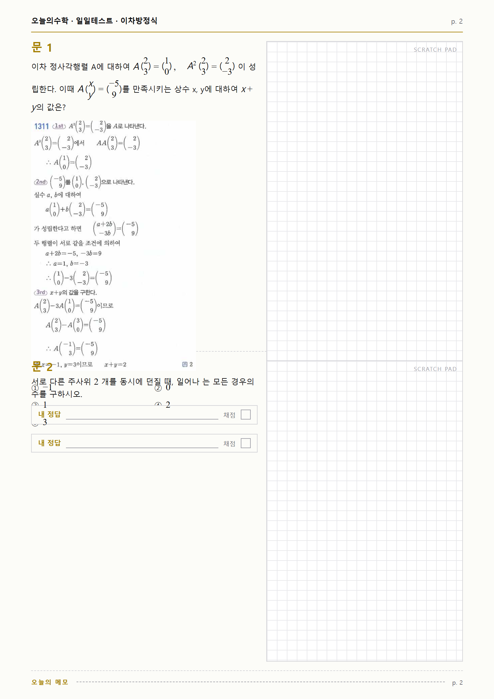
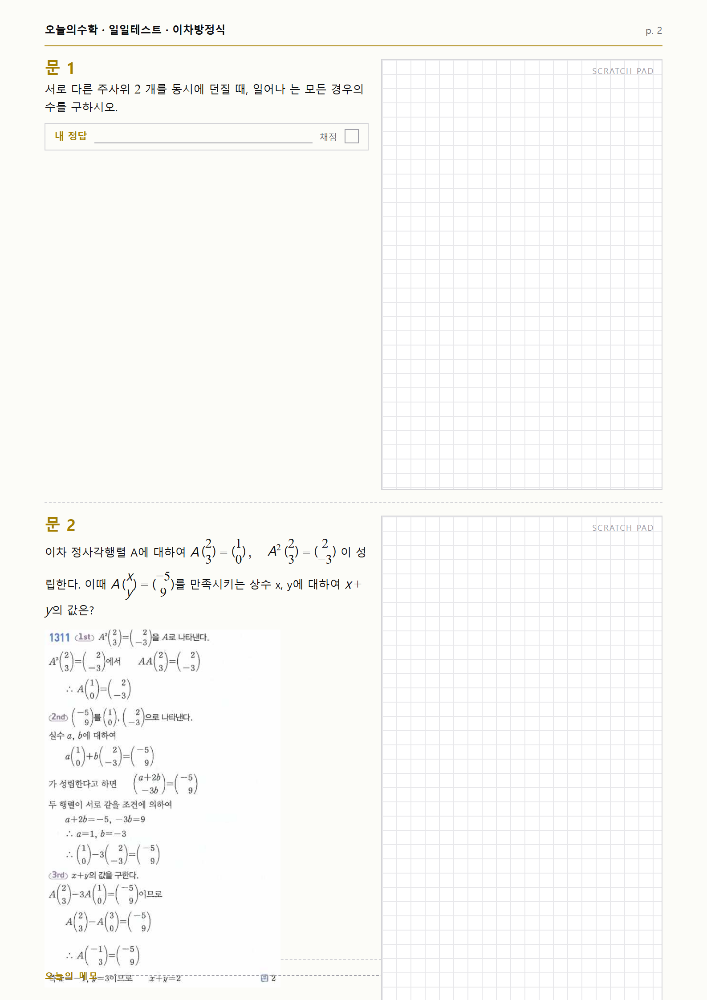
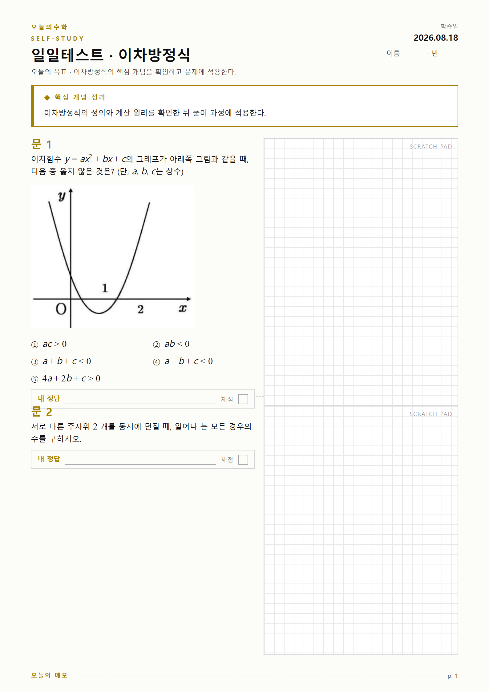
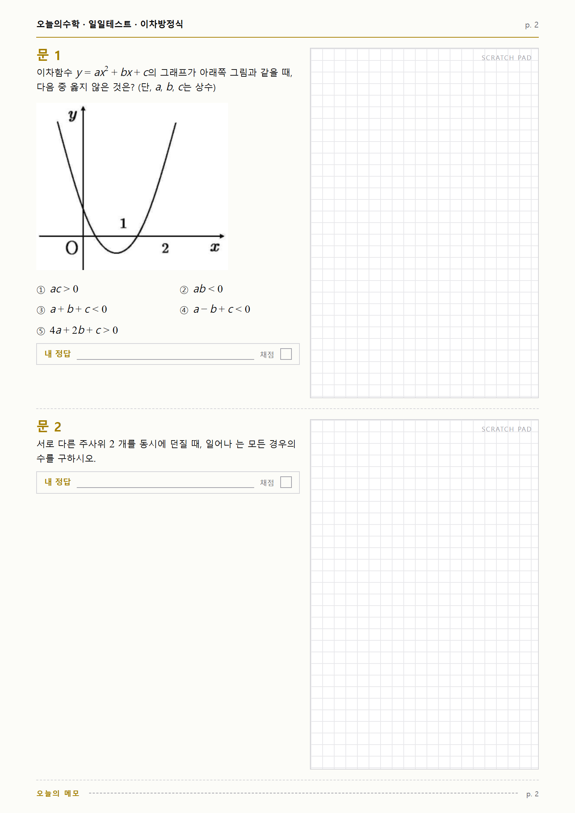
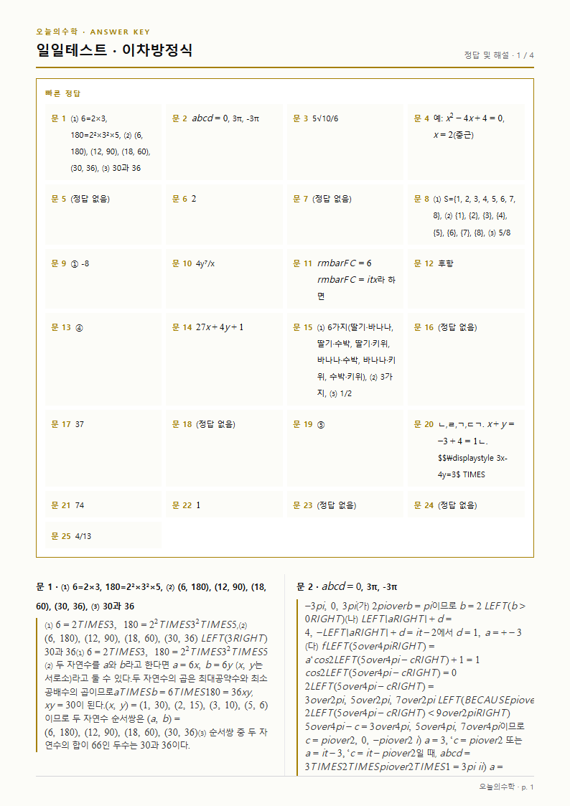

# 적대적 리뷰 ③ — 조판·넘침·지면

브랜치 `BIGSHOL/adv-print` · 2026-08-18 · **제품 코드는 한 줄도 고치지 않았다**
재현물 `qa/adversarial/_adv-print-overflow.test.ts` (`npm run test:adv`) · 남긴 도구 §9

대상: `src/lib/printOverflow.ts` · `printGeometry.ts` · `printLayout.ts` · `printPack.ts`
· `src/components/print/**` · `src/lib/math/displayWidth.ts` · `scripts/qa/calibrate-overflow-lines.ts`

---

## 0. 한눈에

| # | 소견 | 심각도 | 실측 |
|---|------|--------|------|
| ① | **그림 1장짜리 문항이 경고의 사각지대다** | 🔴 | 그림 1장 7,930건 중 **2,109건이 실측 넘침** · 규칙은 그림 2장부터 본다 |
| ② | **넘침은 «잘림»이 아니라 «겹침»이다** — 문서가 말하는 `.problemBox` 는 없다 | 🔴 | `overflow:hidden` 은 `.a4Page` 하나뿐. 1번이 넘치면 2번 위에 겹쳐 찍힌다 |
| ③ | **첫 장은 칸이 79px 좁은데 판정도 분할도 모른다** | 🔴 | 첫 장 405px / 이어지는 장 484px · **첫 장에서만 넘치는 문항 3,216건** |
| ④ | **정답지는 판정 대상이 아니다** | 🔴 | 해설 있는 문항으로 짠 정답지 480장 중 **134장(27.9%)에서 해설이 통째로 사라진다** |
| ⑤ | 줄 수 추정기의 «자»가 지면과 다르다 (고정 chrome·상자 마진·열 폭) | 🟡 | 모든 문항에서 **3.08줄**, 상자마다 1.8줄, 1열 보기마다 2.4줄 덜 센다 |
| ⑥ | 2열 판정이 **과잉** 쪽으로 치우쳐 지면을 세로로 늘린다 | 🟡 | 1열로 내려간 문항의 **15.9%** 는 2열 칸에 전부 들어간다 (전수 환산 ≈440문항) |
| ⑦ | 미리보기 높이와 인쇄 높이가 다르다 | 🟡 | 7,373문항(15.64%) — 다만 **전부 미리보기가 더 큰 쪽**이라 잘림을 감추지는 않는다 |
| — | 못 깨뜨린 것 — 2열 문턱 24 · 폭 530 을 546으로 안 올린 판단 · 줄 수 14 · 인쇄 지연로딩 · 서술형 배지 | 🟢 | §8 |

**경고 전체 성능(전수 47,152건, 인쇄 매체, 이어지는 장 484px 기준)**

```
실측 넘침            2,725 (5.78%)
경고                 1,450 — 맞음 827 · 헛것 623
★ 넘치는데 경고 없음 1,898 → 재현율 30.3%
```

같은 전수를 **첫 장(405px)** 기준으로 보면 넘침 5,941건 · 재현율 **19.4%** (놓침 4,790).

---

## 1. 어떻게 쟀나 — 추정이 아니라 실제 렌더 높이

jsdom 은 높이를 주지 않는다. 그래서 **진짜 A4 지면을 Chromium 에 그려서** 쟀다.
붙인 CSS 셋은 전부 제품이 쓰는 것 그대로다.

1. `katex/dist/katex.min.css` — `src/app/layout.tsx` 가 로드하는 것
2. Tailwind 산출물 — `src/app/globals.css` 를 **postcss 로 실제 빌드**한다
3. `TestPrint.module.css` **원문** — 클래스 이름을 해시하지 않아 지면 DOM 과 그대로 맞는다

DOM 은 `JaseupTemplate` 의 구조를 그대로 옮겼고, 문항 본문은 제품과 같은
`ProblemContent`(`deferFigures={false}`)를 `renderToStaticMarkup` 으로 그린다.
그림은 `public/figures` 의 **실제 파일**을 `file://` 로 읽는다.

측정값:
* `needed` = 문항번호 **위**부터 정답란 **아래**까지 (`getBoundingClientRect`)
* `avail` = `article.clientHeight − padding` (**grid row 가 아니다** — 아래 함정 4)

### 측정이 조용히 거짓이 되는 함정 넷 — 넷 다 밟았다

1. `page.setContent` 는 about:blank 라 `file://` 스타일시트가 막힌다 → 파일로 써서 `goto`.
   (`measure-choice-layout.tsx` 가 먼저 밟아 둔 함정이다.)
2. **Tailwind v4 는 `@source` 를 안 주면 유틸리티를 한 줄도 안 낸다.** 처음 빌드한 CSS 에는
   `mt-4`·`grid-cols-2`·`my-4` 가 **전부 없었다.** 그대로 쟀으면 지면이 통째로 낮아 보이고
   「넘침 거의 없음」이 나왔을 것이다. → 산출물에 `.mt-4` 가 있는지 검사하고 없으면 중단한다.
3. `page.evaluate` 안에서 **이름 붙은 함수**를 만들면 esbuild 가 `__name` 헬퍼를 끼워 넣어
   ReferenceError 로 죽는다. 그런데 `browser.close()` 를 건너뛰어 **프로세스가 멈춘 채로
   대기**한다 — 실패가 에러가 아니라 «느림»으로 보인다.
4. **문항 칸의 남은 공간을 `questionArea.clientHeight` 로 재면 넘침이 영원히 0이 나온다.**
   `.problemItem` 은 grid 이고 row 가 `auto` 라, 내용이 넘치면 **row 가 같이 늘어난다.**
   실제로 첫 측정에서 넘친 칸만 `avail` 이 484 → 647 로 커져 `needed ≈ avail` 이 됐다.
   칸의 진짜 크기는 `article` 의 content box 다.
   (CLAUDE.md 2026-08-16 「손상이 심할수록 그 손상을 정상으로 읽는 가드가 생긴다」의 또 한 사례다.
   넘치는 문항일수록 «넘치지 않는다»고 읽혔다.)

**접힘 판정은 높이로 하면 안 된다** — 분수 하나만 있어도 줄 상자가 20.3px 를 넘어
«한 줄인데 접혔다»가 된다. 같은 글꼴 문맥에 nowrap 사본을 만들어 **폭**으로 가른다.
(높이로 셌을 때 2열 접힘이 39건 나왔고, 폭으로 세니 **0건**이었다.)

### 지면 실측 상수 (인쇄 매체)

| 무엇 | 실측 | 추정기의 가정 |
|---|---|---|
| A4 | 1122.5px (297mm) | — |
| **이어지는 장 문항 칸** | **484.0px** | 없음(칸 높이를 안 본다) |
| **첫 장 문항 칸** | **405.0px** | 없음 |
| 본문 행높이 | 20.3125px | — |
| 문항 열 | 363.5px = **58.2단위** | `COLUMN_UNITS = 59` |
| 1열 보기 글자칸 | 345.0px = **55.2단위** | 59 (마커 ①·`gap-1.5` 를 안 뺀다) |
| 상자 항목칸 | 329.5px = **52.7단위** | 59 (`p-4`·테두리를 안 뺀다) |
| 문항번호+정답란 | **62.5px = 3.08줄** | **0줄** |
| 상자의 글자 아닌 세로 | **98.0px = 4.82줄** | 3줄 (`BOX_CHROME_LINES` 2 + 라벨 1) |
| 보기 그리드 `mt-4`·행간격 | 16px · 8px×n | 0줄 |

---

## 2. 🔴① 그림 1장짜리 문항이 경고의 사각지대다 — **이 리뷰의 성과**

### 무엇이 틀렸나

`estimateProblemLines(content)` 는 **본문 문자열만** 받는다. 인자에 그림이 없다.
그림을 보는 규칙은 `OVERFLOW_FIGURE_LIMIT = 2` 하나뿐인데, 실데이터의 그림 문항은
**94%가 1장짜리**다. 즉 그림 문항의 절대다수가 **어떤 규칙에도 닿지 않는다.**

### 실데이터 근거

```
그림 장수      문항 수    그중 실측 넘침
0             38,710       168 (0.43%)   ← 현행 규칙이 167건 잡는다(재현율 99.4%)
1              7,930     2,109 (26.6%)   ← 규칙에 **닿지 않는다**
2 이상            512       448 (87.5%)   ← 규칙이 잡는다
```

넘치는 2,725건 중 **2,557건(93.8%)이 그림 문항**이다.
그림 있는 문항의 «추정 줄 수 대 실측 줄 수» 차이는 **중앙 15.37줄** (90분위 20.4줄).

그림만으로 얼마나 먹는지 (이미지 원본 치수 12,129장 + `print:max-w-[70mm]` 로 계산):

```
인쇄 그림 높이  중앙 207px(10.2줄) · 90분위 305px · 99분위 1,145px · 최대 4,879px
그림 + 고정 chrome 만으로 이어지는 장 칸(484px)을 넘는 문항   358건
                                    첫 장 칸(405px) 기준     683건
```

**표본** — 실데이터 `0129fdcd-8f19-42e3-99a1-5e3137ebf721`
(그림 `/figures/4729/hwp-q03.png` 원본 598×688 → 인쇄 폭 70mm 로 264.6×304.4)

```
실측 지면 높이 550.5px  (칸 484px — 66px 초과)
폭 171 (<530) · 추정 5줄 (<14) · 그림 1장 (<2)  →  경고 0건
```

더 큰 것: `003d67c5-…` 실측 **662px**(칸의 137%) · 추정 8줄 · 폭 299 · 그림 1장 → 경고 없음.
아래 스크린샷의 문항이 이것이다.

### 재현물

`_adv-print-overflow.test.ts` › `[적대③-A]` 세 건.

### 심각도 🔴 — 잘려서 학생에게 나간다

---

## 3. 🔴② 넘침은 «잘림»이 아니라 «겹침»이다 — 모형 자체가 틀렸다

### 무엇이 틀렸나

`printOverflow.ts` 머리 주석과 `src/__tests__/unit/printOverflow.test.ts` 머리 주석이
둘 다 이렇게 적었다:

> 자습 지면은 문항 하나가 고정 높이 반 페이지 박스이고 `.problemBox` 에 `overflow: hidden` 이
> 걸려 있다.

**`.problemBox` 라는 클래스는 존재하지 않는다.** 저장소 전체에서 그 이름이 나오는 곳은
저 주석 한 줄뿐이다. `TestPrint.module.css` 의 `overflow: hidden` 은
`.a4Page`(지면 전체)와 `.answerSolutions`(정답지 해설단) **둘뿐**이고,
`.problemItem` 에는 `overflow` 가 없다.

결과가 다르다. `.problemItem` 은 `flex: 1; min-height: 0` 이라 **높이는 반 페이지로 고정**
되지만 **클립이 없어 내용이 밖으로 나간다.** 그래서

* **1번 문항이 넘치면 → 2번 문항 위에 겹쳐 찍힌다.**
  「그 문항만 조금 잘린다」가 아니라 **멀쩡한 옆 문항까지 못 읽게 된다.**
* **2번 문항이 넘치면 → 보기·정답란이 지면 밖으로 밀려 통째로 사라진다.**

### 실데이터 근거 — 그림으로



문 1(`003d67c5`)이 178px 넘쳤다. 「문 2」 제목이 문 1의 그림 위에 겹쳐 찍히고,
문 2의 보기 ①~⑤가 문 1의 «내 정답» 칸을 관통한다. **문 2는 풀 수 없다.**



같은 문항을 2번 자리에 두면 **보기 ①~⑤와 「내 정답」 칸이 아예 인쇄되지 않는다.**
꼬리말 「오늘의 메모」가 그림 위에 겹친다. 학생 손에 가는 시험지에는
**답지가 없는 객관식 문항**이 실린다.

같은 지면을 Chromium 으로 **실제 A4 PDF** 로 뽑아 확인했다(`02-slot2-clipped.pdf`):
페이지 수 **1** — 넘친 내용이 다음 장으로 가지 않고 그 자리에서 사라진다.

### 왜 중요한가

지금 경고 문구는 이렇다.

> 지면을 넘길 수 있는 문항이 있습니다 — … 인쇄 미리보기에서 잘리지 않았는지 확인하십시오.

원장이 찾을 것은 «잘린 문항»인데 실제로 눈에 들어오는 것은 «글자가 겹친 옆 문항»이다.
찾는 대상이 틀리면 경고가 있어도 지나친다.

### 재현물

`[적대③-E]` 두 건. (`.problemBox` 가 없다는 쪽은 지금도 **초록**이다 — 사실 확인용으로 남겼다.)

### 심각도 🔴

---

## 4. 🔴③ 첫 장은 칸이 79px 좁은데, 판정도 분할도 그걸 모른다

### 무엇이 틀렸나

첫 장에는 머리글과 「◆ 핵심 개념 정리」 상자가 얹힌다. 그만큼 문항 칸이 줄어든다.

```
첫 장 문항 칸        405.0px
이어지는 장 문항 칸  484.0px
차                    79.0px  = 3.9줄 = 칸의 16.3%
```

그런데
* `packProblems` 는 **문항 수로만** 자른다 (`questionsPerPage: 2`, 장 구분 없음).
* `assessOverflowRisk` 는 배열 인덱스를 알면서도(`index + 1` 로 번호를 붙인다)
  **한계를 하나만 쓴다.**

그래서 **같은 문항이 1·2번이면 잘리고 3번이면 멀쩡하다.**

### 실데이터 근거

```
이어지는 장(484px)에서 넘침   2,725 (5.78%)
첫 장(405px)에서 넘침         5,941 (12.60%)
★ 첫 장에서만 넘침            3,216 (6.82%)  ← 그중 경고도 없는 것 2,892건
```

**표본** `000083c0-48ae-4cf2-829b-0f38b29b4c54` — 실측 439px.
이어지는 장(484)에는 들어가고 첫 장(405)에서는 34px 넘친다. 추정 5줄 · 폭 193 · 그림 1장 → 경고 없음.




### 재현물

`[적대③-B]` 세 건 (한 건 — 「79px 차이가 있다」 — 은 사실 확인용이라 초록).

### 심각도 🔴

---

## 5. 🔴④ 정답지는 판정 대상이 아니다

### 무엇이 틀렸나

`assessOverflowRisk` 는 `problem.content` 만 읽는다. **`solution` 은 한 글자도 안 본다.**
그런데 정답지에도 클립이 있다 — `.answerSolutions { overflow: hidden }` 이고
`column-count: 2` 라, 높이를 넘긴 해설은 **3번째 단**으로 밀려 지면 밖에서 사라진다.
한 문항의 해설이 **통째로** 없어진다(부분 잘림이 아니다).

게다가 `paginateAnswerKey` 는 장당 8건 고정인데 **1쪽에는 「빠른 정답」 상자가 더 얹힌다**
— 그 상자는 시험지 전 문항을 4열로 늘어놓으므로 문항 수에 비례해 커진다.

### 실데이터 근거 (시험지 120개 × 25문항, 인쇄 매체)

| 문항 풀 | 정답지 장 수 | 해설이 잘린 장 | 그중 1쪽 |
|---|---|---|---|
| 해설이 있는 문항만 (13,909건) | 480 | **134 (27.9%)** | **95** (1쪽 120장 중 79%) |
| 전체 풀 (47,152건, 해설 없는 문항 섞임) | 480 | 23 (4.8%) | 14 |



문 1~7 만 찍히고 **문 8 은 지면 어디에도 없다.** 2단 아래쪽에 빈 공간이 남아 있는데도
그렇다 — 3번째 단으로 밀렸기 때문이다.

> 곁가지: 이 스크린샷의 해설에 `aTIMESbTIMEScTIMESd`·`fprime`·`sqrt5` 같은 HWP 잔재가
> 보인다. 수식 잔재 축(`render-d-math-residue.md`)의 소관이라 여기서는 세지 않았다.

### 재현물

`[적대③-C]` 두 건.

### 심각도 🔴

---

## 6. 🟡⑤ 줄 수 추정기의 «자»가 지면과 다르다

세 군데에서 **일관되게 덜 센다.** 방향이 한쪽이라 오차가 상쇄되지 않는다.

| 무엇 | 지면 | 추정기 | 문항당 부족분 |
|---|---|---|---|
| 문항번호 + 정답란 | 62.5px | **0** | **3.08줄 — 모든 문항** |
| 상자 하나 | 98.0px (`my-4` 32px 포함) | 3줄 = 60.9px | 1.83줄 × 상자 수 (상자 문항 3,573건) |
| 1열 보기 글자칸 | 345.0px = 55.2단위 | 59단위 | 폭 6.4% |
| 상자 항목칸 | 329.5px = 52.7단위 | 59단위 | 폭 **10.7%** |
| 보기 그리드 `mt-4` + 행간격 | 16px + 8px×(행−1) | 0 | 1열 5보기면 1.8줄 |

**표본별 실측 대 추정** (`scripts/qa/measure-paper-units.tsx`)

```
plain-1line          실측 1.00줄  추정 1줄   차 0.00
nobox-two-items-30   실측 3.00줄  추정 3줄   차 0.00
box-two-items-30     실측 9.04줄  추정 8줄   차 1.04
choices-two-col-5    실측 5.58줄  추정 4줄   차 1.58
choices-one-col-20   실측 8.36줄  추정 6줄   차 2.36
```

전수에서도 같다 — 추정 줄 수와 실측 줄 수(높이÷행높이)의 차 중앙값:

```
본문만    9,366건  3.08줄   ← 정확히 고정 chrome 몫(62.5px)
보기 있음 26,325건  4.65줄
상자 있음  3,019건  6.08줄
그림 있음  8,442건 15.37줄  ← §2
```

**다만 이것이 지금 넘침을 만드는 원인은 아니다.** 한계 14줄이 결과적으로 이 부족분을
흡수하고 있어서, 그림 없는 문항에서는 재현율 98.8%(놓침 2건)가 나온다(§7).
그래서 🟡 로 둔다 — **고칠 때 한계와 «자»를 **같이** 고쳐야 한다**는 뜻이다.
자만 고치고 한계 14를 그대로 두면 경고가 폭증하고, 한계만 올리면 부족분이 되살아난다.

### 재현물

`[적대③-D]` 네 건.

---

## 7. 🟡 임계값 재점검 — «분모가 바뀐 채로 물려받은» 것들

브리핑이 지목한 세 값을 실측 넘침과 대조했다. 결론부터: **셋 다 지금 값이 맞다.**
문제는 문턱이 아니라 §2 의 사각지대다.

### 폭 한계 530 — 546으로 올리지 않은 판단은 **옳았다**

`body-typeset.md` 는 「예전과 같은 건수로 맞추려면 546으로 올려야 하지만, 새로 걸린 104건이
진짜 긴 문항이라 올리지 않았다」고 적었다. 실측으로 검산하면:

```
[그림 없는 38,710건 · 넘침 168건]
  폭 > 530   경고 485   맞음 124   헛것 361   놓침 44   재현율 73.8%
  폭 > 546   경고 414   맞음 119   헛것 295   놓침 49   재현율 70.8%
```

546으로 올렸으면 **놓침이 5건 늘었다.** 「같은 건수로 맞추기」를 포기한 것이 결과적으로 옳다.
다만 근거가 달랐다 — 보고서는 「눈으로 보니 진짜 길더라」였고, 실측 근거는 「재현율이 3%p 떨어진다」다.

### 줄 수 한계 14 — 맞다 (그림 없는 문항에 한해)

```
[그림 없는 38,710건]
  줄 수 > 14      경고 455   맞음 166   헛것 289   놓침  2   재현율 98.8%
  현행 셋 합집합   경고 703   맞음 167   헛것 536   놓침  1   재현율 99.4%
```

놓친 1건은 `f8603ace-…`(실측 492px, 칸을 8px 초과, 추정 **딱 14줄**)이다 — 경계선이다.

그런데 **전수로 보면 같은 규칙의 재현율이 12.2%로 떨어진다.** 분모가 그림 문항까지
넓어지기 때문이다. 「한계 14가 최선」이라는 `calibrate-overflow-lines.ts` 의 결론은
**폭 규칙과 건수를 맞춘 것**일 뿐 지면과 맞춘 것이 아니다.
한계를 8까지 내려도 전수 재현율은 50.1%까지밖에 안 오른다 —
**문턱을 옮겨서는 해결되지 않는다.** 이 저장소가 이미 두 번 배운 그것이다(문턱이 아니라 자).

그림 높이를 세면 바로 갈린다:

```
[전수] 추정 줄 수 + (그림 실측 높이 ÷ 행높이)
  한계 16줄   경고 4,832   맞음 2,705   헛것 2,127   놓침  20   재현율 99.3%
  한계 18줄   경고 3,307   맞음 2,522   헛것   785   놓침 203   재현율 92.6%
  한계 20줄   경고 2,196   맞음 1,784   헛것   412   놓침 941   재현율 65.5%
```

### `TWO_COLUMN_WIDTH_LIMIT = 24` — 놓침은 0, 과잉은 15.9%

전수에서 균등 추출한 1,210문항을 지면에 그려 **양쪽으로** 셌다.

```
놓침 — 2열 칸 4,055개 중 접히는 것        0 (0.00%)
과잉 — 1열 문항 69건 중 전부 2열에 들어감 11 (15.94%)
       (보기 있는 문항 881건 중 1열 7.8% — 전수 8.0% 와 일치)
```

`displayWidth` 에 연산자 여백을 넣은 수리는 **실측으로 확인된다** — 2열 칸 4,055개에서
접힘이 하나도 없다. 반대쪽은 안 재고 있었다: 1열로 내려간 문항의 약 1/6 은
2열에 그대로 들어간다. 전수 2,770건에 환산하면 **약 440문항**이 이유 없이
세로로 길어졌고(5지선다면 3줄 → 5줄), 자습 지면은 장당 2문항 고정이라 그 높이가 곧 넘침이다.

---

## 8. 🟢 못 깨뜨린 것

깨보려 했으나 실측으로 문제가 없었던 것들이다. 다음 사람이 같은 곳을 다시 파지 않게 남긴다.

### 인쇄 경로가 화면과 갈라지는가 — **갈라지지만 안전한 쪽으로만**

`PaperProblemView` 의 `framed` 분기는 의도대로다.
* 인쇄 템플릿(`ProblemBody`)은 `framed={false}` → `deferFigures={false}` →
  `` 에 `loading`/`decoding` 속성이 **아예 안 붙는다.** 지연 로딩으로 그림이 빠질 일은 없다.
* `.paperParity`(가로 스크롤·`padding-block`)는 화면 전용이라 인쇄물에 안 붙는다.

높이 차이는 있다. 화면은 그림 상한이 `sm:max-w-[360px]`, 인쇄는 `print:max-w-[70mm]`(264.6px)다.

```
미리보기와 인쇄의 문항 높이가 다른 문항   7,373 (15.64%)
  인쇄가 더 큼                              0
  미리보기가 더 큼                      7,373   (최대 차 1,540px)
★ 미리보기는 멀쩡한데 인쇄에서 넘침         0
  미리보기는 넘치는데 인쇄는 멀쩡        1,747
```

**미리보기가 인쇄를 감추는 방향의 사고는 없다.** 대신 1,747문항에서 헛것을 보여 준다 —
경고 문구가 「미리보기에서 확인하라」고 말하는데 미리보기가 지면보다 비관적이라,
반복되면 원장이 미리보기를 안 믿게 된다. 그 자체는 🟡 이고 ⑦ 로 세었다.

부수적으로: 보기 2열은 화면에서 `md:`(뷰포트 768px 이상)로 갈린다. 창을 768px 미만으로
줄이면 미리보기만 1열이 된다 — 이 역시 **미리보기가 더 높아지는** 방향이다.

### 서술형 배지 — 인쇄되고, 높이를 늘리지 않는다

인쇄 매체에서 실측: `display: inline` · 색 `rgb(165,127,0)`(금색) · 테두리 1px,
`.a4Page` 에 `print-color-adjust: exact` 라 테두리째 인쇄된다.
배지가 있는 문항번호 줄과 없는 줄의 높이가 **둘 다 18px** 로 같다(배지 자체는 19px 지만
인라인이라 줄 상자를 밀지 않는다). **넘침에 기여하지 않는다.**

### 상자 테두리 — 인쇄 변형이 실제로 나온다

`print:border-black` 이 빌드 산출물의 `@media print` 블록에 실재한다
(`print:grid-cols-2`·`print:grid-cols-3`·`print:break-inside-avoid`·`print:max-w-[70mm]` 도 같다).

### `printPack` 은 옛 가정으로 2문항씩 넣는가 — **그렇다. 다만 그게 D-07 설계다**

`packProblems` 에는 높이 개념이 없다. 하지만 지면 형태(장당 2문항)는 원장님 확정 사항이므로
분할이 높이를 보게 만드는 것은 **이 리뷰가 결정할 일이 아니다.**
여기서 결함으로 세는 것은 ③ **첫 장이 79px 좁다는 사실이 어디에도 없다**는 점뿐이다.

### 사유가 겹칠 때 하나만 적는 것 — 의도된 동작

`assessOverflowRisk` 는 폭 사유가 걸리면 배치 사유를 안 적는다(`!reasons.length` 가드).
주석에 「원장이 읽을 문장이라 겹쳐 적지 않는다」고 근거가 있다. 다만
`printOverflow.test.ts` 의 「사유가 겹치면 둘 다 적는다」 테스트는 폭+그림 조합이라
**이 가드를 지나가지 않는다** — 그 테스트가 지키는 것은 폭+그림뿐이다. (🟢 관찰)

### 문단 사이 여백은 0이다 — `prose*` 클래스가 빌드에 없다 (🟢 관찰)

`MarkdownRenderer` 는 루트에 `prose prose-slate max-w-none prose-p:my-2 prose-headings:my-3`
를 붙인다. 그런데 **`@tailwindcss/typography` 가 설치돼 있지 않다** — 빌드 산출물에
`.prose` 로 시작하는 규칙이 **하나도 없다**(스타일시트를 훑어 확인했다). 그래서
문단 여백은 Tailwind preflight 의 `margin: 0` 이 그대로다 — 실측 `0px/0px`.

`printOverflow.ts` 는 이렇게 적었다:

> 문단 사이 여백 `prose-p:my-2` 는 위아래가 겹쳐 약 8px = 0.4줄이라 따로 세지 않는다.

**그 8px 은 존재하지 않는다.** 세지 않은 것은 결과적으로 맞다(우연히 보수적이다).
지면 쪽 영향은 상자 밖 본문이 2문단 이상인 **1,954건**에서 「세부 문항 ⑴ ⑵ 가 줄만 바뀌고
여백은 0」으로 나타난다. 조판 의도(8px)와 실제(0px)가 다르다는 사실만 남긴다 —
여백을 줄지 말지는 지면 형태라 원장님 확정 사항이다(D-07).

### 마지막 장의 홀수 문항

문항 수가 홀수면 마지막 장의 한 문항이 `flex: 1` 로 **지면 전체 높이**를 받는다(약 1,015px).
그 문항은 사실상 넘치지 않는다. 결함이 아니라 여유다 — 다만 넘침 통계를 낼 때
「모든 문항이 484px 칸에 놓인다」고 가정하면 약간 비관적이라는 뜻이다.

---

## 9. 남긴 도구 (전부 재실행 가능 · DB 는 읽기만)

| 스크립트 | 무엇을 재는가 |
|---|---|
| `scripts/qa/paperProbe.tsx` | 지면 실측 공용 하네스 (CSS 조립 · DOM 생성 · 거짓 측정 가드) |
| `scripts/qa/measure-print-overflow.tsx` | 문제지 전수 넘침 + 경고 대조 (`--first-page` · `--screen` · `--json`) |
| `scripts/qa/measure-answerkey-overflow.tsx` | 정답지 해설 잘림 (`--with-solution` · `--shot`) |
| `scripts/qa/measure-paper-units.tsx` | 추정기의 «자» 검증 (열 폭·상자 chrome·고정 chrome) |
| `scripts/qa/measure-choice-columns.tsx` | 2열 판정의 **놓침과 과잉을 양쪽으로** |
| `scripts/qa/shot-print-overflow.tsx` | 넘침 지면 스크린샷 + 실제 A4 PDF |

실행 예:

```bash
npx tsx scripts/qa/measure-print-overflow.tsx                  # 전수 · 이어지는 장 · 인쇄 매체
npx tsx scripts/qa/measure-print-overflow.tsx --first-page
npx tsx scripts/qa/measure-answerkey-overflow.tsx --with-solution
npx tsx scripts/qa/measure-paper-units.tsx
npx tsx scripts/qa/measure-choice-columns.tsx --take 1200
```

## 10. 재현물

`qa/adversarial/_adv-print-overflow.test.ts` — `npm run test:adv`
**14건 중 12건 빨강.** 초록 2건은 사실 확인용이다
(`.problemBox` 가 없다 · 첫 장과 이어지는 장의 칸 차가 79px 다).

`npm run test`(1,369 통과 · 1 skip) · `type-check` 0 · `lint` 0 error ·
`lint:affordance` 통과 — 제품 코드를 안 고쳤으므로 전부 그대로다.

---

## 11. 고치려면 (제안 — 지면 형태는 안 건드린다)

지면 형태는 D-07 확정 사항이라 **판정 쪽만** 손대는 안이다. 우선순위대로.

1. **그림 높이를 판정에 넣는다** (🔴①). `figureUrls` 로 이미지 치수를 알 수 있으면
   `min(natural, 70mm)` 비율로 높이를 구해 줄 수로 환산한다. 치수를 모르면
   «그림 1장 = 중앙값 10줄» 같은 보수적 상수라도 넣는다 — 지금은 0줄이다.
   실측으로 재현율 30.3% → 92.6%(한계 18줄, 헛것 785건).
   · 치수는 적재 때 DB 에 넣어 두는 편이 낫다(런타임 파일 접근 없이 판정 가능).
2. **장을 아는 판정** (🔴③). `assessOverflowRisk` 가 `packProblems` 의 결과를 받아
   첫 장 문항에는 더 엄격한 한계를 쓴다. 두 상수(405/484)는 `printGeometry.ts` 로 올린다.
3. **정답지도 판정한다** (🔴④). `solution` 길이·수식량으로 같은 방식의 경고를 낸다.
   `paginateAnswerKey` 의 1쪽 정원을 문항 수에 따라 줄이는 것은 **지면 배치 변경**이므로
   원장님 확정 대상이다.
4. **경고 문구를 사실에 맞춘다** (🔴②). 「잘립니다」가 아니라
   「앞뒤 문항과 **겹쳐 인쇄**될 수 있습니다」가 실제로 일어나는 일이다.
5. **«자»와 한계를 같이 고친다** (🟡⑤). 고정 chrome 3.08줄·상자 1.83줄·열 폭 3종을
   바로잡고, 한계는 그때 **칸 높이 484px 에서 유도**한다(폭 규칙과 건수를 맞추지 않는다).
   순서를 지킬 것 — 한쪽만 고치면 경고량이 통째로 튄다.
6. **2열 문턱의 과잉을 줄인다** (🟡⑥). 문턱 24는 그대로 두고 `displayWidth` 의
   `OPERATOR_EXTRA`(3단위)가 과하게 붙는 자리를 찾는다. 여기도 **문턱이 아니라 자**다.

## 12. 이번에 되풀이된 교훈

* **손상이 심할수록 그 손상을 정상으로 읽는 가드가 또 나왔다.** 넘친 문항일수록
  grid row 가 늘어나 `avail` 이 커지므로, 칸을 row 로 재면 **넘침이 영원히 0**이다(§1 함정 4).
* **지표가 실패를 셀 수 있는 형태인지 먼저 볼 것.** `estimateProblemLines` 의 인자에는
  그림이 없다. 인자에 없는 것은 임계값을 어떻게 옮겨도 안 잡힌다 —
  실제로 한계를 14에서 8까지 내려도 전수 재현율은 50%를 못 넘었다.
* **주석이 코드보다 오래 산다.** `.problemBox` 는 두 파일의 머리 주석에만 있고
  CSS 에는 없다. 그 한 줄 때문에 「잘림」이라는 틀린 그림이 테스트 이름과
  경고 문구까지 퍼졌다.
* **양쪽을 세라.** 2열 판정은 «접힘»만 세고 있었다. 접힘은 0이 됐지만
  반대쪽(과잉 1열)은 아무도 안 세고 있었고, 그게 지면을 세로로 늘리고 있다.
