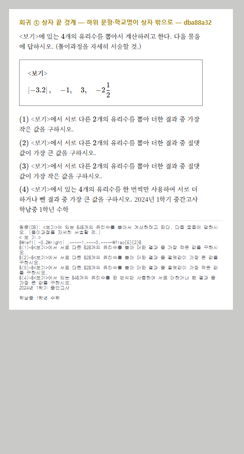
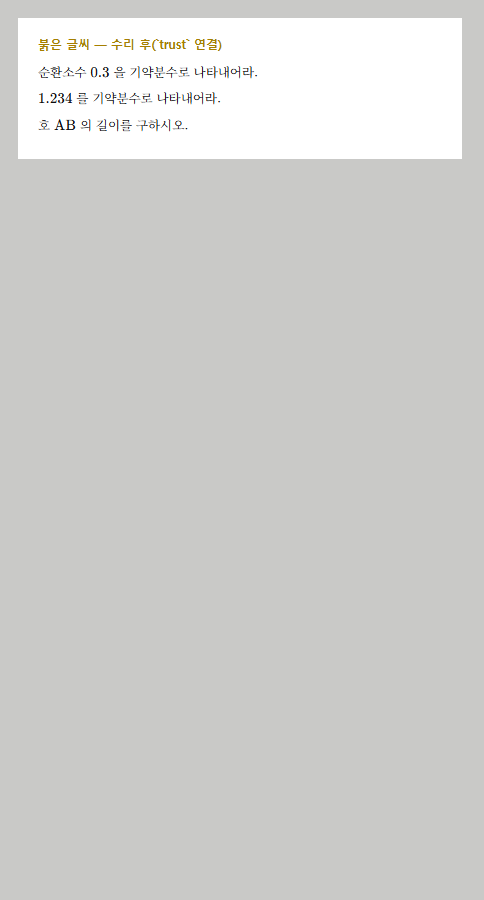
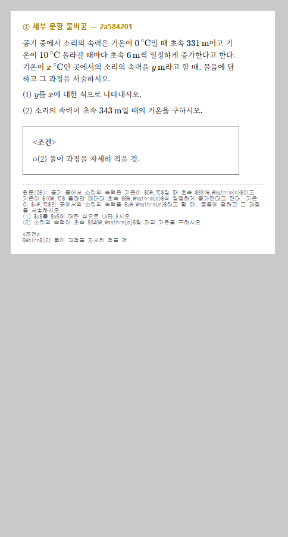
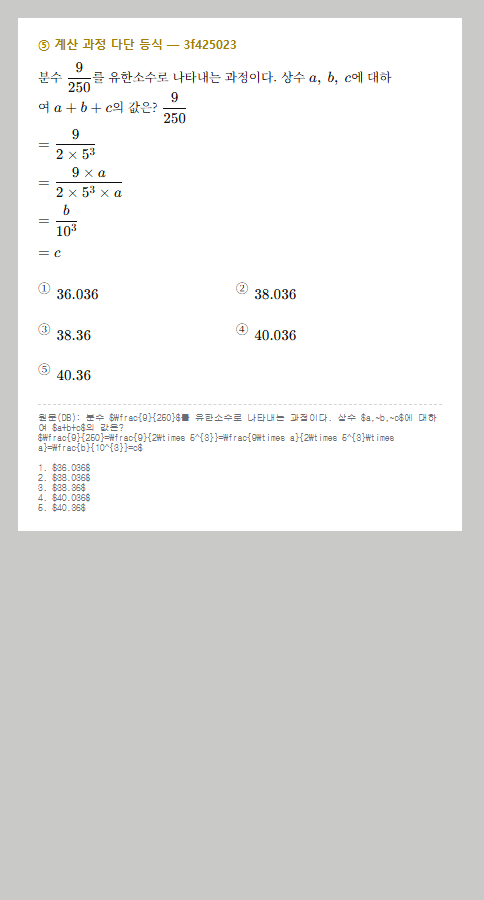
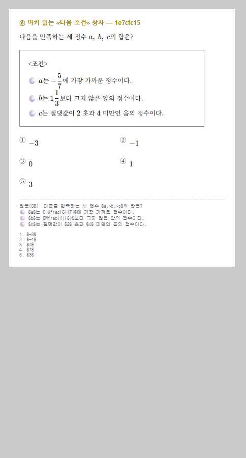
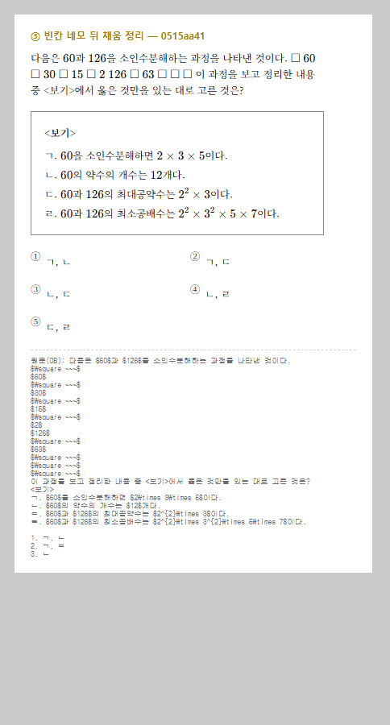
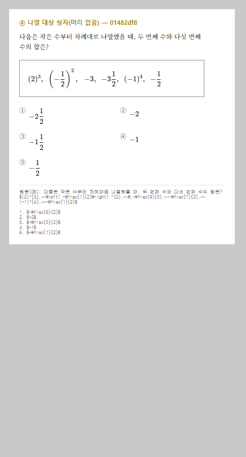

# 본문 조판 수리 — 2026-08-18 원장님 지적 8건

브랜치 `BIGSHOL/subq-break` · 소유 범위 `src/components/math/**` · `src/lib/math/**`
· `src/lib/problem/parseProblemContent.ts` · `src/components/print/TestPrint.module.css`
· `scripts/qa/**`

스크린샷: [`body-typeset/`](./body-typeset/) (수리 후 지면, 실제 KaTeX CSS·지면 글꼴·지면 열 폭)

---

## 0. 한눈에

| # | 지적 | 결과 | 실측 영향 |
|---|------|------|-----------|
| 회귀① | 상자가 하위 문항·학교명까지 삼킴 | **고침** | 끝 경계 오판 121 → 84개 (-30.6%) |
| 회귀② | 긴 보기가 2열에서 접힘 | **고침** | 2열 오판 35 → 4개 · 1열 문항 6.0% → 8.0% |
| 추가 | 붉은 글씨 320행 (`\htmlClass` 거부) | **고침** | 붉은 글씨 0 · 잠금 테스트 추가 |
| ⑤ | 계산 과정 다단 등식이 안 나뉨 | **고침** | 53문항 |
| ⑥ | 마커 없는 «다음 조건» 상자 | **고침** | +52문항 |
| ① | 세부 문항 줄바꿈 | **고침** | 1,783문항 (3.78%) |
| ② | 분수가 위아래와 겹침 | **재현 안 됨** | §4 — 실측 4종 전부 겹침 0 |
| ③ | `□` 뒤 공백 과다 | **고침** | 86문항 · 채움 737개 제거 |
| ④ | 나열 대상을 상자로 | **고침(정렬은 확인 대기)** | 14문항 |

완료 조건: `npm run test` 초록(919 통과·1 skip) · `type-check` 0 · `lint` 0 error ·
`lint:affordance` 통과. main 병합 안 함.

### 넘침 경고 전후 (전수 47,152건)

| 규칙 | 수리 전(main 5c0b1400) | 수리 후 | 차이 |
|------|------|------|------|
| 폭 규칙 (`displayWidth > 530`) | 605건 (1.28%) | **709건 (1.50%)** | +104 |
| 줄 수 규칙 (`> 14줄`) | 474건 | **623건** | +149 |

두 증가의 성격이 다르다. **폭**은 임계값이 그대로인데 **자가 바뀌어서**(연산자 여백을
세게 됨) 같은 숫자가 다른 뜻이 됐다 — 예전과 같은 건수로 맞추려면 한계를 546으로
올려야 하지만, 새로 걸린 104건을 눈으로 보니 원문 350~630자짜리 **진짜로 긴 문항**이라
올리지 않았다. **줄 수**는 지면이 실제로 세로로 길어진 것이다(세부 문항 줄바꿈 +22,
계산 과정 +7, 조건 상자 +1, 그리고 보기 1열 전환 +707문항의 여파).
줄 수 한계 **14**는 재보정에서도 최선이다(13은 949, 15는 415로 폭 규칙 규모에서 더 멀다).

> ⚠️ **절대 규칙 6** — 아래 전부 지면이 바뀐다. 실물 프린터 출력 검수가 필요하다.

---

## 1. 회귀 ① 상자 끝 경계 (심각)

원장님: "보기만 네모에 넣으면 되는데 **문제 속 문제까지 보기 안에 넣어버렸고
마지막에 학교 이름까지 적어버렸음**"



### 왜 통과했나
어제 규칙은 소문항을 `[⑴⑵⑶⑷⑸⑹]` **여섯 글자로만** 알았고, 그마저 **수식이 가려진
사본(probe)** 에서 찾았다. 실데이터의 소문항은 `$(1)~$` 처럼 **수식 span 통째**로
실려 있어 가려지고, 반각 괄호이며, ⑺ 이상으로도 이어진다 — 셋 다 못 봤다.

그리고 **어제 보고서는 「상자로 못 만든 67건」만 셌지 「잘못 만든 것」은 세지 않았다.**
그게 이 회귀가 통과한 진짜 이유다. 이번에 `scripts/qa/audit-box-boundary.ts` 로
«잘못 만든 것»을 세는 감사를 만들었다.

### 새 판정 — `src/lib/math/subQuestion.ts`
세 조건을 **동시에** 요구한다: ① 모양이 깨끗하다(수식 span 통째 / 줄머리 / 괄호원문자)
② 앞이 영문자·숫자·프라임이 아니다 ③ **1부터 잇따라 오르는 번호가 2개 이상**.

전수 감사에서 가드가 **정확히 거꾸로** 걸린 것을 두 번 잡았다:

| 잘못 건 가드 | 버려진 진짜 문항 |
|---|---|
| 「앞이 닫는 괄호면 함수값」 | `[그림] ⑴ …` · `[총 $7$점] $(1)$ …` · `…서술하시오.) $(2)$ …` |
| 「앞 수식의 마지막 글자를 앞 글자로」 | `$15$ $8$ $(1)$ …` — 숫자 `8` 때문에 |

고친 뒤 판정 문항 **822 → 1,286 → 1,733건**. 버린 894건은 표본 전량 함수값이었다.

### 실측
```
상자 3,677 → 3,679개 · 상자를 그린 문항 3,573건(변화 없음)
끝 경계 의심          121 → 84 (-30.6%)
  물음표(발문 삼킴)     52 → 30
  하위문항 (1)         30 → 22   ← 남은 것은 감사 도구의 오탐(`f(1)`)
  시험지 머리말         12 →  4
  학교명+학년            7 →  0
잃은 상자 1건(정답 위치의 `(가)(나)(가)(나)` 파편) · 새 상자 1건(진짜 <조건>)
```

### 이 수리에서 밟은 함정 셋 (전부 실데이터로 드러났고 테스트로 잠갔다)
1. 꼬리말을 「`단,` 부터 끝까지 지운다」로 짰더니 **항목까지 지워져** 멀쩡한 상자
   19개를 잃었다(단서가 발문과 항목 **사이**에 오는 문항).
2. 꼬리 자를 자리를 「마지막 줄바꿈」으로 잡았더니 `(단, …)` 줄을 집어 **발문이 상자에
   남고 상자가 통째로 버려졌다.** → 경계 뒤에 물음표를 요구.
3. 「빈 줄이 있으면 문단이 더 있다」 가드는 이 말뭉치에서 **못 쓴다** — PDF 텍스트
   레이어라 `\n\n` 이 사방에 있다. 걸었더니 꼬리말 10개를 놓쳤다.

### 별건 보고 — 시험지 머리말
`2024년 1학기 중간고사 …중 1학년 수학` 이 **본문에 남아 있는** 문항 **144건(0.31%)**.
렌더에서 상자에는 안 들어가게 막았지만 **본문에는 여전히 찍힌다**(위 스크린샷 마지막 줄).
데이터에서 걷어낼지는 이 워크트리 밖(원장님 결정) 사안이라 손대지 않았다.

---

## 2. 회귀 ② 긴 보기가 2열에서 접힘

원장님: "여전히 보기가 길어서 미리보기에서 줄바꿈 처리되는 문제가 있네"

### 원인 — 문턱이 아니라 **자**가 틀렸다
`displayWidth` 는 글리프를 **개수**로 셌다. KaTeX 는 이항·관계 연산자 좌우에 여백을 넣는다.
브라우저 실측(12.5px 지면 글꼴):

| 입력 | 실측 | 뜻 |
|---|---|---|
| `$ab$` | 14.5px | 글자 하나 ≈ 7px |
| `$a+b$` | 33.0px | **`+` 하나가 17px** |
| `$a=b$` | 34.6px | `=` 하나가 18.6px |

한글 한 글자 12.1px = 표시폭 2 → 1단위 ≈ 6.05px. **연산자마다 약 1.8단위가 빠져 있었다.**
어제 넣은 한계 24는 `$a+2>b+2$ 일 때, $a>b$ 이다.`(실측 193.5px, 칸 147px)를
폭 24로 세어 «2열에 둬도 된다»고 판정했다. 그게 접힘이다.

### 측정 기준을 새로 만들었다
`scripts/qa/measure-choice-layout.tsx` — 실제 KaTeX CSS·지면 폭·지면 글꼴로 Chromium 에
그려 `getBoundingClientRect` 로 잰다. 표본 605문항 → 보기 조각 2,247개.
**실제로 2열 칸을 넘는 보기 118개(5.3%).**

측정을 두 번 거짓으로 만든 함정도 스크립트 주석에 못 박아 두었다:
`page.setContent` 는 about:blank 라 `file://` 스타일시트가 **조용히 막힌다**
(KaTeX CSS 없이 재면 `$2\sqrt{5}$` 가 6,459px 로 나온다) · 사본을 `document.body` 에
붙이면 **글꼴 크기를 잃어**(12.5→16px) 측정값이 정확히 1.28배 부푼다.

### 고친 것
연산자 여백 **+3단위**(이항 뺄셈 포함, **부호** 마이너스는 제외) ·
순환소수 점 표기 **+6단위**(전처리가 CSS 점 span 으로 그려 근사보다 훨씬 넓다).

**한계값 24는 한 자도 안 바꿨다.** 문턱을 옮겨 맞추려 했다면 최선이 17이었고 그래도
오판 29건이 남았다 — 문제는 문턱이 아니라 자였다.

| 한계 24 고정 | 수리 전 | 수리 후 |
|---|---|---|
| 놓침(접히는데 2열) | 34 | **2** |
| 과잉(안 접히는데 1열) | 1 | **2** |
| 합 | 35 | **4** |

지면 영향: 보기 1열로 내려가는 문항 **2,063건(6.0%) → 2,770건(8.0%)**. +707문항의
보기 배치가 2열 → 1열로 바뀐다(세로로 길어진다).

---

## 3. 붉은 글씨 320행 — 우리가 만든 글자를 우리 렌더가 거부했다

수식잔재 세션(`BIGSHOL/math-residue`)이 원인을 찾았고 `MarkdownRenderer` 소유가
이쪽이라 여기서 연결했다. **받은 보고를 그대로 믿지 않고 먼저 재현했다** — 네 케이스가
모두 붉게 나왔고 `trust` 하나로 넷 다 정상이 됐다.



`preprocessMathText` 는 스스로 `\htmlClass{repeat-dot}{…}`(순환마디 점)·
`\htmlClass{geom-arc-wrap}{…}`(호 ⌒)를 **만든다**. 그런데 `MarkdownRenderer` 는
`rehypeKatex` 에 옵션을 하나도 안 넘겼다. KaTeX 는 `trust` 없이 HTML 확장을 거부하는데
**예외를 던지지 않는다** — `color:#cc0000` 붉은 날문자로 그린다.

### 그런데 잠금 파일 자체가 고장나 있었다
「왜 해시가 하나만 바뀌지?」를 파고들다 찾았다. `renderParity.test.tsx` 의 케이스
문자열이 역슬래시를 **한 번만** 써서 TypeScript 가 escape 로 먹고 있었다:

* `"$\frac{7}{25}$"` → 실제로는 **폼피드(U+000C) + `rac{7}{25}`**
* `"$0.\overline{3}$"` → 실제로는 `$0.overline{3}$`

결과가 둘이다. (1) `분수-유한소수`·`원문자-보기`·`극한-limits` 는 **줄곧 붉은 글씨를
잠그고** 있었고 해시는 내내 초록이었다. (2) `순환소수-점표기` 는 `\overline` 이 사라져
**순환마디 경로를 한 번도 지나가지 않았다** — 이 파일이 지키려던 바로 그 경로다.

문자열을 바로잡고 해시를 다시 뽑았다: **바뀜 12 · 그대로 6 · 새 키 2.**
그대로인 6개는 **역슬래시가 원래 없던** 케이스라 안 바뀌는 것이 맞고, 그게 이 갱신이
회귀가 아니라는 증거다.

그리고 **「출력에 `#cc0000`·`katex-error` 가 없다」** 검사를 대표 문항·Mock 전량·
HTML 확장 5종에 대해 붙였다. 해시 잠금은 «달라졌는가»만 보므로 **처음부터 붉으면
붉은 채로 잠긴다.** 수리 전 이 검사를 돌리면 6건이 빨개진다.

---

## 4. ② 분수 겹침 — **재현되지 않았다**

원장님: "이런 문제는 보기 높이를 좀 더 줘야할듯. 분수라서 위아래 보기와 겹침"

네 가지 표면을 실제 브라우저에서 쟀고 **어디서도 겹침이 없었다.**
도구는 `scripts/qa/measure-fraction-overlap.tsx` 로 남겼다(재실행 가능).

**(1) 본문 — 줄 상자가 자란다.** 같은 글자수·같은 줄수인데 한쪽만 분수인 쌍으로 비교:

| 3줄 문단 | 평문 | 수식 | 차이 |
|---|---|---|---|
| 분수 하나 | 60.1px | 67.1px | +7.0 |
| 겹분수 | 60.1px | 86.6px | +26.5 |
| 합기호 | 60.1px | 86.9px | +26.8 |

**(2) 보기 격자 — 칸끼리 겹침 0.** 분수 5개·겹분수+근호 섞임 모두 «칸 밖으로 나온
잉크 0.0px · 칸끼리 겹침 0».

**(3) 화면 지면틀(`.paperParity`) — 잘림 0.** 첫 줄에 분수·겹분수·합기호·적분이 와도
위/아래 잘림 0.0px.

**(4) `.repeat-dot` CSS** — 순환마디 점은 `padding-top` 으로 제 자리를 **예약**하므로
(절대 위치가 아니다) 붉은 글씨 수리로 이 클래스가 살아나도 위 줄을 침범하지 않는다.

### 그래서 무엇이었나 — 짐작과 부탁
가장 그럴듯한 것은 **§3 의 붉은 글씨**다. 같은 회차 스크린샷이고,
`0.\htmlClass\htmlClass이 되었고` 처럼 끊기지 않는 날문자 덩어리가 나가고 있었다.
그 건은 고쳤다.

**줄 간격은 손대지 않았다.** 통째로 키우면 분수 없는 문항까지 헐거워지고 지면 세로
배분이 바뀌는데(장당 2문항 고정이라 넘침으로 직결), 근거 없이 47,152건을 움직일 수 없다.
**여전히 겹쳐 보이면 그 문항 번호나 스크린샷을 주시면** 같은 도구로 그 문항만 재서
원인을 잡겠다.

---

## 5. ① 세부 문항 줄바꿈

원장님: "이런경우는 세부 문항이 줄바꿈 처리되어야할텐데?"



판정은 회귀 ① 에서 만든 `subQuestion.ts` 를 **그대로** 쓴다 — 상자 경계와 같은 규칙이
아니면 「상자는 여기서 끊었는데 줄은 저기서 바꾼다」가 된다.

`collapseWhitespace` 가 개행을 전부 녹이므로 **녹이기 전에** 제어문자로 자리를 표시했다가
녹인 뒤 문단으로 되살린다. 상자 **안**의 항목 번호는 건드리지 않는다.

실측: **1,783건(3.78%)** · 마커 4,352개. 느슨한 후보가 2개 이상인 2,627건 중 844건은
규칙이 버렸고, 표본 전량 함수값(`f(0)+f(1)`·`(0,4)`·`(x+2)(x-3)`)이었다.

---

## 6. ⑤ 계산 과정 다단 등식

원장님: "이런 문제는 좀 심각하네. 다음 계산 과정이 너무 줄바꿈 하나도 처리 안되어있음"



### 위험은 «자르면 안 되는 것»이다 — 세 번 좁혔다
「한 수식에 `=` 가 2개 이상」으로 세면 2,724건(5.78%)인데 표본을 눈으로 보니
**거의 전부 오탐**이었다 — 나열(`$y=ax,~y=bx$`)·연립방정식·주어진 조건
(`$\overline{AE}=\overline{BF}=a$`)·괄호 안 첨언(`(x=0,1,2)`).

1. 쉼표가 **사이에** 없으면 이음 → 2,724 → 970건
2. 괄호를 **네 종류 다** 세기(`{}` `()` `[]` `\{\}` `\left\right`) → 첨언 배제
3. 실데이터를 돌려 보니 나쁜 출력이 나왔다:
   `$\overline{AE}=\overline{EG}=\square (마),~\overline{ED}=…$` 를 잘라
   **`=\square (마),~\overline{ED}`** 라는 조각(앞 문장 꼬리 + 뒤 문장 머리)이 나왔다.
   → 최상위 쉼표가 **하나라도** 있으면 손대지 않는다.
   `$\overline{BF}=\overline{FH}=x$` 가 세 줄로 쌓이는 것도 봤다 → 가장 넓은 단계가
   표시폭 8 이상일 것.

최종 규칙은 넷을 동시에 요구한다. **독립 근거**는 문항이 스스로 「…과정이다」라고
말하거나 수식이 열보다 넓거나 둘 중 하나다. 「풀이 과정을 서술하시오」는 학생에게
시키는 **지시문**이라 근거가 아니다(테스트로 잠갔다).

실측: **53건(0.112%)** · 수식 71개. 자르는 자리는 언제나 수식 span 경계를 새로 만들어
조각마다 `$` 짝이 맞고 중괄호가 균형을 이룬다. 균형이 안 맞으면 아예 안 자른다.

**확인 대기(D-07)**: 단계를 **문단으로 쌓는** 형태로 두었다. 등호를 세로로 맞추는(align)
조판은 원장님 확정 후에 얹는 것이 맞다고 보고 보수적인 쪽으로 두었다.

---

## 7. ⑥ 마커 없는 «다음 조건» 상자

원장님: "문제에 '다음 조건'이라는 말이 있는데 조건만 따로 모아서 네모 박스 안에
넣어두면 훨씬 깔끔"



발문 문구(「다음 조건」·「다음을 모두 만족」…)가 **유일한 근거**다. 항목만 보고 상자를
세우면 아무 불릿 나열이나 상자가 된다.

실측: 문구가 있는 문항 1,936건(4.11%) · 이미 상자 513건 → **마커 없이 불릿만 있는 61건**.
실제 적용 **+52문항**.

### 실데이터가 알려 준 함정 셋
1. **합성함수 `∘` 를 불릿으로 읽는다.** OCR 이 `$(f$ ∘ $g)(3)$` 처럼 합성 기호를 **수식
   밖으로** 쪼개 놓아 수식을 가려도 평문 자리에 남는다. → **첫 항목 기호만** 자리를
   따진다(수식과 수식 사이면 연산자). 뒤 항목까지 같은 잣대를 대면 안 된다 —
   `∘ $A=…$ ∘ $B=…$` 처럼 항목이 통째로 수식인 조건 목록이 실제로 있다.
2. **`□` 를 불릿으로 읽는다.** `□ABCD` 가 두 번 나온 것뿐이다. → 목록에서 뺐다
   (`⋅`=`\cdot` 도 같은 이유).
3. 조사 스크립트에서 「이미 상자인가」를 `splitBoxSegments(question)` 로 다시 판정했더니
   **늘 「상자 아님」** 이 나왔다 — `question` 은 이미 처리된 마크다운이라 라벨이
   `<상자1>`(열 수가 붙은 형태)이고 정규형이 아니다. 그래서 61건이 181건으로 부풀었다.

---

## 8. ③ 빈칸 네모 뒤 공백

원장님: "네모 표현은 좋았는데 네모 뒤에 공백이 너무 많아보여. 공백 해결 방안 없는지 확인"



### 원인 (CSS 가 아니다)
HWP 수식의 `{BOX{~~ 1. ~~}}` 에서 `~` 는 **한 칸 공백**이다. 변환기
(`scripts/qa/hwpeq_unglue.py`)가 `BOX` 만 `\square` 로 바꾸고 채움은 그대로 흘려보냈다.
LaTeX 의 `~` 는 비줄바꿈 공백이라 **개수만큼 그대로 쌓인다.**

브라우저 실측: `$\square$` 11.8px · `$\square ~$` 15.5px · `$\square ~~~$` **23.1px**
— 채움이 네모 자신만큼 넓다. 전수: `~` 를 가진 문항 6,217건 · 수식 안 뭉치 16,638개 ·
**네모 바로 뒤 699개 뭉치 / 114문항**.

### 두 층에서 고쳤다
1. **변환기** — 앞으로 변환할 것이 깨끗해진다(원인 자리).
2. **렌더 전처리** `collapseBlankBoxPadding` — 이미 DB 에 들어간 47,152건은 변환기를
   고쳐도 안 바뀌므로 **같은 규칙**으로 정리한다. 주석에 서로를 가리켜 두었다.

### 건드리지 않는 것 — 여기가 위험이다
전체 `~` 16,638개 중 **13,792개가 쉼표 뒤**(`$1,~2,~3$`)다. 목록 간격이라 지우면 숫자가
붙는다. **네모에 잇닿은 채움과 빈칸 수식 끝의 채움만** 건드린다.

실측: 채움이 줄어든 문항 **86건** · 해당 문항의 `~` 1,460 → 723 (**737개 제거**).
나머지 6,131문항의 `~` 는 한 개도 안 바뀐다.

---

## 9. ④ 나열 대상 상자

원장님: "다음 작은 수를 네모 박스 안에 넣으면 더 깔끔할텐데 … 박스를 가운데 정렬하면
문제가 더 깔끔해 보일듯. 이건 hwp 변환기에 있는 건데 비슷하게 벤치마킹해봐."



### 정본에 그 규칙은 없었다
`F:\시험지변환기/core/content_parser.py` 를 읽었다. **거기 박스 판정도 우리와 같은
마커 기반**이고, 발문 뒤 마커 없는 나열을 상자로 올리는 코드는 없다. 베낄 규칙이 없어
데이터에서 신호를 찾았다.

대신 그 저장소의 박스 **모양**은 참고했다 — `core/bogi_box_template.py` 의 5×5 병합표:
내용 셀 양옆에 스페이서 셀(849 폭), `vertAlign="CENTER"`. 즉 **정본은 내용을 상자 안에서
가운데로 둔다.**

### 신호
발문이 「나열」류를 말하는 문항 478건(1.01%) 중
* 이미 상자 76건
* **발문 물음표 뒤**에 나열이 오는 33건 ← 상자 대상
* 발문 **안**에 나열이 박힌 122건 ← **건드리지 않는다.** 빼내면 문장이 끊긴다
  (`세 수 $a=…$, $b=…$, $c=…$ 의 대소관계는?`)

여기에 「꼬리가 나열**뿐**일 것」·「항목 넷 이상」을 더해 실제 적용 **14문항**.

### 머리 없는 상자
나열 대상은 «보기»도 «조건»도 아니라 라벨을 얹으면 **없던 이름이 생긴다.**
`BoxSegment.headerless` 를 두고 마크다운에 전용 머리말 `<나열N>` 로 실어 렌더러가
머리 줄을 그리지 않게 했다. 테두리만 두른다.
(첫 스크린샷에서 `<나열1>` 이 날문자로 찍힌 것을 보고 잡았다 — 스크린샷이 잡은 결함이다.)

### 확인 대기 (D-07) — 가운데 정렬
| 시안 | 내용 | 근거 |
|---|---|---|
| **A** | 상자는 폭 그대로, **안 내용만 가운데** | 정본(시험지변환기)이 이 방식 |
| **B** | 상자 폭을 내용에 맞추고 **상자를 지면 가운데** | 원장님 표현에 더 가까움 |

지금은 **왼쪽 정렬**(기존 상자와 같음)로 두었다 — 형태는 원장님 확정 사항이라 보수적인
쪽으로 둔다(절대 규칙 1). 확정되면 한 줄 CSS 로 바꾼다.

---

## 10. 남긴 도구 (전부 재실행 가능)

| 스크립트 | 무엇을 재는가 |
|---|---|
| `audit-box-boundary.ts` | 상자 끝 경계를 **잘못 잡은** 것 (어제 안 세던 것) |
| `audit-subquestion-rule.ts` | 하위 문항 판정이 **잡은 것과 버린 것** 양쪽 |
| `measure-choice-layout.tsx` | 보기의 **실제 렌더 폭** (2열 판정 기준) |
| `measure-fraction-overlap.tsx` | 분수가 위아래와 **실제로 겹치는지** |
| `measure-equation-chains.ts` | 계산 과정 이음 실태 |
| `measure-bare-conditions.ts` | 마커 없는 조건 상자 실태 |
| `measure-enumeration-box.ts` | 나열 대상 실태 |
| `measure-tilde-space.ts` | HWP `~` 채움 실태 |
| `shot-body-typeset.tsx` | 이 보고서 스크린샷 재생성 |

---

## 11. 이번에 되풀이된 교훈

CLAUDE.md 의 «손상이 심할수록 그 손상을 정상으로 읽는 가드가 생긴다»가 **다섯 번** 더
나왔고, 다섯 번 다 **표본을 눈으로 봐서** 찾았다.

1. 「앞이 닫는 괄호면 함수값」 → `[그림] ⑴` 같은 진짜 하위 문항을 먼저 버렸다.
2. 「`단,` 부터 끝까지 지운다」 → 항목까지 지워 멀쩡한 상자 19개를 잃었다.
3. 「빈 줄이 있으면 문단이 더 있다」 → 이 말뭉치는 `\n\n` 이 사방에 있어 못 쓴다.
4. 「이미 상자인가」를 처리된 마크다운으로 되물었다 → 늘 「아님」이 나왔다.
5. `renderParity` 가 **자기 입력이 깨진 줄 모르고** 붉은 글씨를 3년 치 잠그고 있었다.

그리고 새로 하나 — **측정 장치도 손상된다.** 브라우저 측정에서 스타일시트가 조용히
막히거나(6,459px) 사본이 글꼴 크기를 잃어(1.28배) 값이 통째로 거짓이 됐다.
두 함정 모두 스크립트에 검사와 주석으로 못 박았다.
