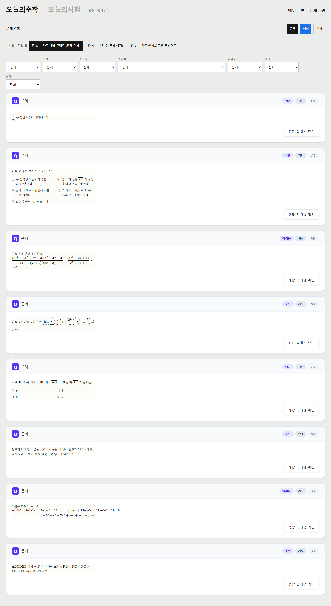
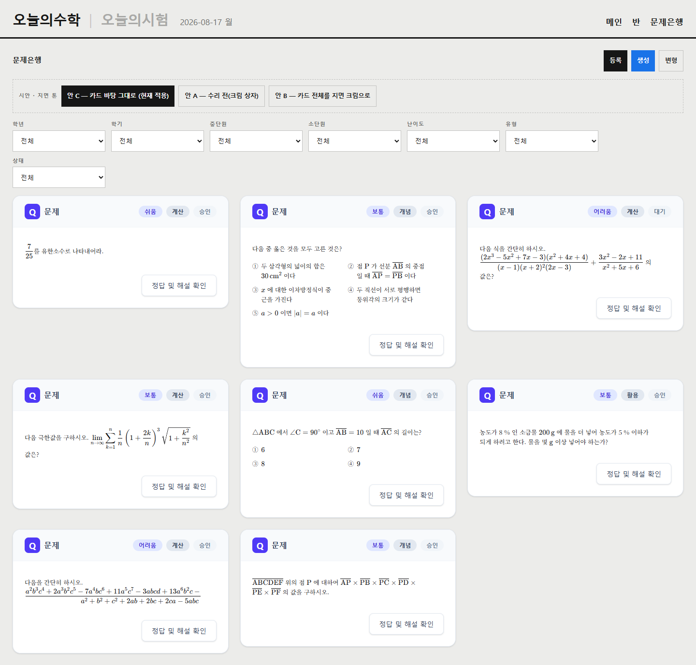
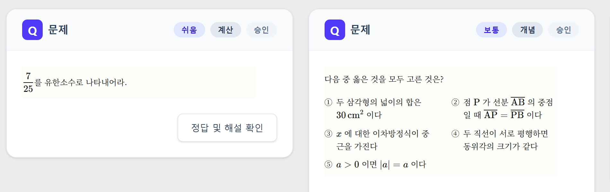
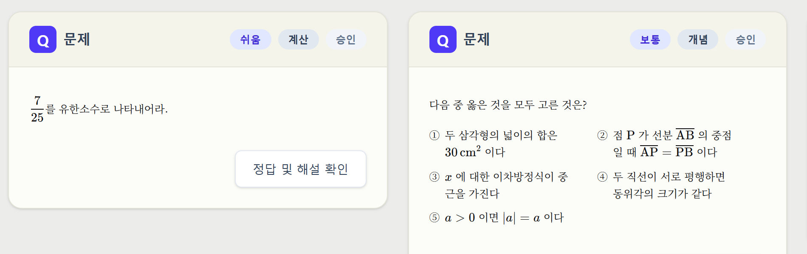
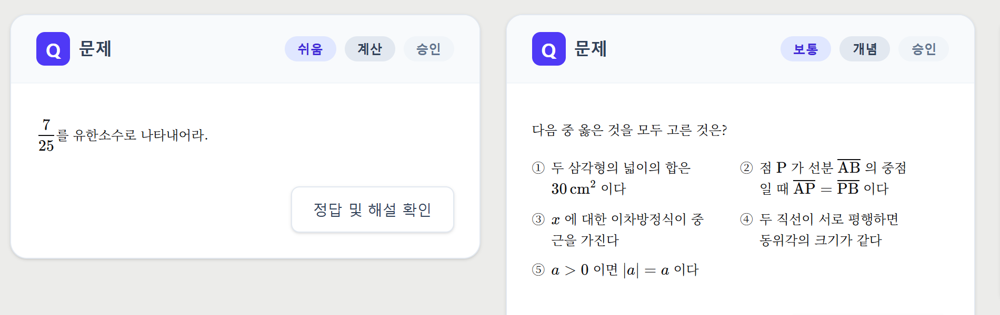
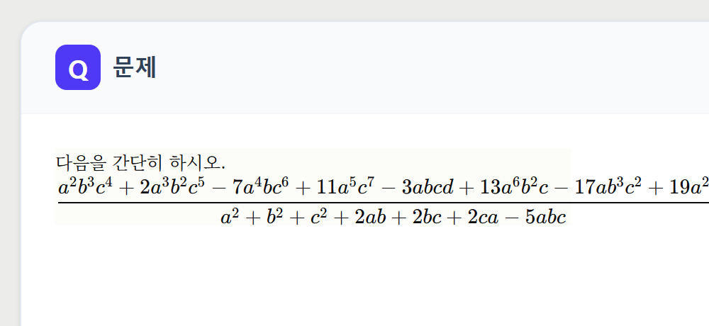
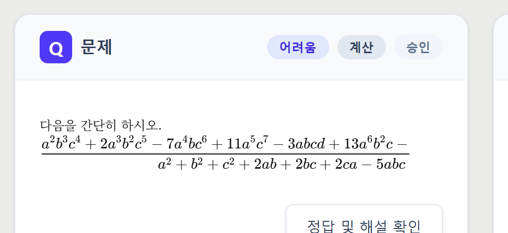
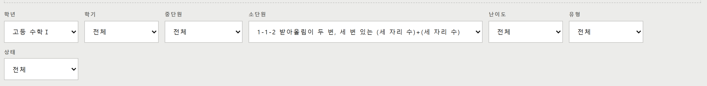
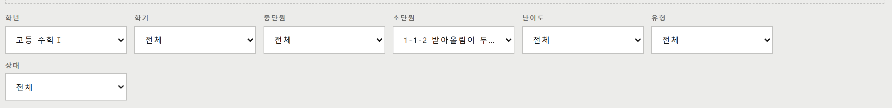
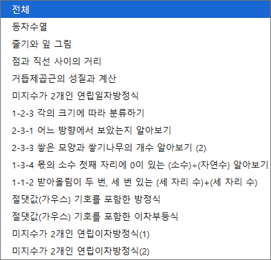

# 렌더 수리 A — 문제은행 화면 지면 배치

- 작업 브랜치: `BIGSHOL/render-layout` (main 병합 전)
- 지시: 원장님 2026-08-17 (스크린샷 3건 동반)
- 소유 범위: `src/components/problem/**`, `src/components/print/{PaperProblemView,TestPrint.module.css,A4Page,tokens}`, `src/app/(main)/problems/**`
- 스크린샷: `docs/planning/tracks/reports/render-a/`
- 시안 화면: `npm run dev` → **`/dev/render-a-preview`** (실데이터 없이 배치를 그대로 본다. 지면 톤 3안 전환 버튼 포함)

## 0. 한 장 요약

| # | 원장님 말씀 | 결과 | 커밋 |
|---|---|---|---|
| 1 | "우측 공간 너무 많이 남아서 기본 2단에 창 크기에 따라서 3단 혹은 1단" | 고침. 1920px 4단 / 1440·1600px 3단 / 1024·1280px 2단 / 820px 이하 1단 | `424dba44` |
| 2 | "문제 내부 색상이 왜 다르지?" | 고침(안 C 적용) + **3안 시안 제시, 확정 대기** | `d45be0c8` |
| 3 | "이런것도 자동 줄바꿈 되면 좋겠지만" | 인라인 수식은 **이미 줄바꿈되고 있었다**. 못 끊는 경우만 지면 열 경계에서 스크롤로 가둠 | `72e86c50` |
| 4 | "필터 선택할때마다 크기 제각각인데 고정된 크기에서" | 고침. 7칸 전부 192px 고정, 선택을 바꿔도 불변 | `21a70011` |
| 5 | "드랍다운 버튼은 그대로 두고, 드랍다운 목록을 키우는걸로" | **네이티브로 이미 그렇다.** 실물 Chrome 실측 — 컨트롤 192px, 팝업 394px. 커스텀 구현 불필요 | `21a70011` |
| 6 | "보기가 보기내에서 두줄처리되잖아" | **B 세션 소유 파일이라 넘긴다.** 원인·해법·임계값을 §6 에 정리 | — |
| 7 | "폰트는 아주 만족스러운것 같기도하네" | 서체 **일절 건드리지 않았다** | — |

품질 게이트: `npm run test` 1114 통과 / 1 skip · `type-check` 0 · `eslint` 0 error
(기존 warning 1건은 `lint-staged.config.mjs`, 이 작업과 무관) · `lint:affordance` 통과.
인쇄 잠금 `printPack.test.ts` · `renderParity.test.tsx` 초록 유지.

**인쇄물은 한 픽셀도 바꾸지 않았다.** 근거는 §3 에 있다.

---

## 1. 우측 공백 — 원인은 카드가 아니라 카드 **본문**이었다

### 무엇이 비어 있었나



수리 전(위, 1440px)에는 카드가 창 폭을 다 쓰는데 글은 왼쪽 364px 안에서만 흐르고
오른쪽 950px 가량이 통째로 빈다.



원인은 `TestPrint.module.css` 의 `.paperParity` 다.

```css
width: calc((210mm - 100px - 14px) * 1.15 / 2.15);   /* ≈ 364px, 고정 */
```

이 폭은 A4 지면(210mm)에서 좌우 패딩(50px×2)과 문항 그리드 gap(14px)을 뺀 뒤
`.problemItem` 의 `1.15fr : 1fr` 중 **문항 열 몫**이다. 2026-08-17 원장님 지시
"모든 문제를 인쇄시와 동일한 뷰로"(줄바꿈까지 지면과 동일)의 결과라,
**이 폭을 늘리면 화면 줄바꿈이 지면과 갈라진다.**

### 그래서 폭이 아니라 개수를 늘렸다

카드 하나의 본문은 364px 그대로 두고 카드를 여러 열로 깐다.

```tsx
gridTemplateColumns: `repeat(auto-fit, minmax(min(100%, ${PROBLEM_CARD_MIN_WIDTH}), 1fr))`
```

- **브레이크포인트를 박지 않은 이유**: 창 크기가 아니라 *실제로 남는 폭*에 반응해야
  사이드 패널·브라우저 확대 배율이 달라져도 맞는다.
- **너무 좁은 창 가드**는 `min(100%, …)` 다. 남는 폭이 카드 한 장보다 좁아지면
  열 하한이 100%로 내려가 1단이 된다 — 열을 억지로 만들어 가로 스크롤을 내지 않는다.
- 열 하한 `PROBLEM_CARD_MIN_WIDTH` = 본문 열(364) + 카드 좌우 패딩(24×2) + 테두리(1×2)
  = 약 414px. 이보다 좁은 열이 생기면 카드마다 가로 스크롤이 나므로 그 앞에서 끊는다.

### 실측 (Chrome 151, `/dev/render-a-preview`)

| 창 폭 | 수리 전 | 수리 후 |
|---|---|---|
| 1920 | 1단 | **4단** |
| 1600 | 1단 | 3단 |
| 1440 | 1단 | 3단 |
| 1280 | 1단 | 2단 |
| 1024 | 1단 | 2단 |
| 820 | 1단 | 1단 |
| 640 / 430 | 1단 | 1단 |

전/후 스크린샷: `render-a/01-list-{before,after}-{1920,1440,1024,820,430}.png`

### ⚠️ 확인 필요 — 1920px 에서 4단이 된다

원장님은 "기본 2단, 3단 혹은 1단"이라고 하셨는데, 남는 폭에 반응시키면 1920px 에서는
4단이 나온다. **3단으로 막을지 결정해 주셔야 한다.**

- **막지 않으면(현재)**: 1920px 에서 4열, 우측 공백이 거의 사라진다.
- **3단으로 막으면**: 1920px 에서 3열(약 1290px)만 쓰고 **오른쪽 570px 가 다시 빈다** —
  원장님이 지적하신 그 공백이 부분적으로 돌아온다.

막는 쪽으로 정하시면 그리드에 `max-width` 한 줄만 더하면 된다.

### 곁가지 두 개

- 카드의 `mb-6` 을 뺐다. 간격은 그리드 `gap` 하나만 준다(둘 다 있으면 세로만 두 배).
  인쇄용 `print:mb-4` 는 남겼다.
- 목록 `<section>` 에 `print:block` 을 걸어, **문제은행 화면을 그대로 인쇄했을 때**의
  결과를 종전과 같게 뒀다(시험지 인쇄는 이 화면이 아니라 `TestPrint` 가 그린다).

---

## 2. "문제 내부 색상이 왜 다르지?" — 답과 시안

### 답

`.paperParity` 가 `background: var(--paper-warm)`(#FCFCF8, 지면 크림색)을 칠하고 있었다.
카드 바탕은 흰색(#FFFFFF)이라, **흰 카드 안에 크림색 상자**가 앉아 본문만 형광펜으로
칠한 것처럼 보였다. 상자의 폭·높이가 지면 문항 열 크기라 더 어색했다.

### 3안 (`/dev/render-a-preview` 버튼으로 바로 전환 가능)

| 안 | 모습 | 스크린샷 |
|---|---|---|
| **A** 수리 전 | 흰 카드 + 크림 상자 (색이 갈라짐) | `render-a/02-tone-a-before.png` |
| **B** 카드 전체를 지면 크림으로 | 상자가 사라지고 **카드 자체가 종이**가 된다. 지면 정체성이 화면까지 이어짐 | `render-a/02-tone-b-paper-card.png` |
| **C** 카드 바탕 그대로 (**현재 적용**) | 화면 틀이 배경을 칠하지 않는다. 카드는 흰색 그대로 | `render-a/02-tone-c-applied.png` |

안 A — 수리 전


안 B — 카드 전체를 지면 크림으로


안 C — 카드 바탕 그대로 (현재 적용)


### C 를 기본으로 둔 근거 (형태 결정이므로 확정 대기)

1. 원장님 말씀이 지시가 아니라 **질문**이라 임의로 형태를 바꾸는 폭을 최소로 잡았다.
2. C 는 카드 크롬(머리띠·테두리·배지)을 건드리지 않는다. B 는 카드 색 체계를 새로 정하는
   일이라 그 자체가 별도 확정 사항이다.
3. 어느 쪽이든 **폭·서체·행간은 그대로**다 — 색만 뺀 것이지 지면 틀을 버린 게 아니다.
   `paperFrame.test.ts` 가 `color: var(--paper-ink)` 와 `font-family: var(--paper-font-serif)`
   가 남아 있는지까지 같이 잠근다.

**B 를 고르시면 배경은 카드 쪽에서 주면 되고, 되돌리는 것도 한 줄이다.**

---

## 3. 인쇄물이 안 바뀌었다는 근거

`.paperParity` 는 **화면 전용 클래스**다.

```tsx
// PaperProblemView.tsx
if (!framed) return <div data-paper-view>{body}</div>;              // 인쇄 템플릿 경로
return <div data-paper-view className={styles.paperParity} …>       // 화면 경로
```

인쇄 템플릿(`templates/ProblemBody.tsx`)은 `framed={false}` 로 부르므로 이 클래스가
붙지 않는다. 즉 §2(색)·§4(넘침) 에서 `.paperParity` 에 넣은 규칙은 **인쇄 DOM 에
닿지 않는다.** 지면 종이색은 `.a4Page` 의 `background: var(--paper-warm)` 에 그대로 있고,
`paperFrame.test.ts` 가 그것까지 함께 잠근다(한쪽만 지워지면 빨개진다).

`printPack.test.ts`(어느 문항이 몇 쪽 몇 번), `renderParity.test.tsx`(렌더 HTML 해시)
둘 다 초록 유지. 특히 렌더 HTML 해시는 마크업이 한 글자만 달라져도 깨지는데 통과했다 —
이번 변경이 전부 CSS 이고 DOM 을 건드리지 않았다는 뜻이다.

> **실물 프린터 검수는 이 세션이 하지 않았다.** 인쇄 DOM·CSS 를 바꾸지 않았으므로
> 출력이 달라질 이유가 없다는 것이 근거이고, 절대 규칙 6 의 실물 검수는 인쇄 쪽 변경이
> 생길 때 수행해야 한다.

---

## 4. 긴 수식 — "자동 줄바꿈"은 이미 되고 있었다

### 먼저 확인한 사실

**인라인 수식은 KaTeX 가 이미 줄바꿈한다.** KaTeX 는 최상위 연산자(`+ − × =` 등)마다
`.base` 를 끊어 내보내고, `.katex` 자체에는 `white-space: nowrap` 이 없다
(`nowrap` 은 `.katex .base` 와 `.katex-display > .katex` 에만 있다).

실측 — 표본 카드별 `.base` 개수와 가장 넓은 `.base`:

| 카드 | 본문 | `.base` 개수 | 최대 `.base` 폭 | 열(364px) 대비 |
|---|---|---|---|---|
| 3 | 분수 두 개를 `+` 로 이은 식 | 2 | 245px | 접힘 (정상) |
| 8 | `\overline` 6개를 `\times` 로 이은 식 | 8 | 65px | 접힘 (정상) |
| 4 | `\displaystyle\sum` + `\sqrt` | 1 | 206px | 들어감 |
| **7** | **분수 하나(한 덩어리)** | **1** | **476px** | **넘침** |

즉 못 끊는 건 **한 덩어리인 원자 하나가 열보다 넓을 때**뿐이다. 이건 끊을 자리가
없어서 CSS 로 해결되지 않는다(원자를 쪼개려면 본문 자체를 고쳐야 한다).

### 화면에서 한 처리

수리 전에는 이 식이 지면 열 밖으로 그냥 삐져나갔다 — 크림 상자 오른쪽 끝을 한참 넘어간다.



1단일 때는 카드가 넓어 **전부 보이므로 "지면에도 들어가겠구나"라고 오해하게 된다.**
다단으로 깔면 같은 식이 카드 모서리에 잘린 것처럼 보인다.

그래서 넘침을 **지면 열 경계에서** 가로 스크롤로 가뒀다 — 정확히 364px 에서 끊기고,
그 안에서 스크롤된다.



어느 단 수에서도 같은 자리에서 끊기고, **지면에 안 들어간다는 사실이 화면에 드러난다.**

### `padding-block` 이 왜 짝으로 붙어 있나 (실측)

`overflow-x: auto` 만 걸면 `overflow-y` 도 auto 가 되어 KaTeX 의 세로 오버행이 잘린다.
오버행을 재 봤다:

| 구조 | 오버행 |
|---|---|
| 단순 분수 `\frac{7}{25}` | **5px** |
| 겹분수 `\dfrac{\dfrac{a}{b}+…}{…}` | 3px |
| 큰 연산자 `\sum` + `\int` + `\sqrt[3]{}` | 4px |

`padding-block: 0.6em`(=7.5px @12.5px)이면 전부 흡수한다 — 적용 후 8개 표본 모두
세로 잘림 0. 둘 중 하나만 남으면 조용히 잘리므로 `paperFrame.test.ts` 가 **짝으로** 잠근다.

### ⚠️ 남는 문제 — 지면 쪽 (이 세션 범위 밖)

같은 식이 **인쇄에서는 스크롤이 없다.** `.problemItem` 은 `1.15fr : 1fr` 그리드이고
`.questionArea` 는 `overflow: visible` 이라, 열을 넘는 원자는 **오른쪽 연습칸을 침범**한다
(그 뒤 `.a4Page { overflow: hidden }` 이 지면 밖을 자른다).

그런데 현재 넘침 경고 `assessOverflowRisk` 는 `displayWidth`(글자 수 근사)만 세므로
**이 부류를 못 잡는다** — 글자 수는 적은데 렌더 폭만 넓은 식이기 때문이다.
`src/lib/printOverflow.ts` 는 이 세션 소유가 아니라 손대지 않았다. 권고:

> 넘침 판정에 "수식 원자 하나의 추정 렌더 폭이 지면 열(364px)을 넘는가"를 더할 것.
> 지금 지표는 이 결함을 구조적으로 셀 수 없다 (2026-08-16 "KaTeX 가 초록이라고 지면이
> 멀쩡한 게 아니다" 와 같은 성질의 사각지대).

---

## 5. 필터 — 폭 고정과 "목록만 넓게"

### 무엇이 흔들렸나

`FieldSelect` 의 label 이 `min-w-[148px]` 로 **하한만** 있고 상한이 없었고, 부모가
`flex flex-wrap` 이라 각 칸이 내용만큼 자랐다. 네이티브 `<select>` 는 **가장 긴 option
만큼** 넓어지므로 단원명이 긴 소단원만 크게 벌어졌다.

실측(1440px 창): 학년 148 · 학기 148 · 중단원 155 · **소단원 466** · 난이도 148 · 유형 148 · 상태 148



### 고친 방식

- 필터 바를 `repeat(auto-fill, 12rem)` **고정 트랙 그리드**로. 모든 칸 192px 로 같고,
  창이 좁아지면 열 수만 준다(카드 다단과 같은 원칙).
- **`auto-fit` 이 아니라 `auto-fill` 인 이유**: 학기 칸은 초등 학년을 골랐을 때만 나타나
  칸 수가 6↔7 로 변한다. `auto-fit` 은 빈 트랙을 접어 남은 칸을 늘리므로, 칸이 하나
  생겼다 사라질 때 폭이 흔들린다. `auto-fill` 은 트랙을 유지한다.
- 닫힌 칸은 말줄임(`text-ellipsis`), 고른 값은 `title` 로 마우스만 올려도 끝까지 읽힌다.

실측 — 모든 창 폭에서 7칸 전부 192px, **가장 긴 소단원을 골라도 폭 불변**:

| 창 폭 | 칸 폭 | 줄 수 | 선택 전후 동일 |
|---|---|---|---|
| 1920 / 1600 | 192 ×7 | 1 | 예 |
| 1440 / 1280 / 1024 | 192 ×7 | 2 | 예 |
| 820 | 192 ×7 | 3 | 예 |
| 640 | 192 ×7 | 4 | 예 |
| 430 | 192 ×7 | 7 | 예 |

가장 긴 단원명을 고른 상태 — "1-1-2 받아올림이 두…" 로 말줄임된다.



### 192px 을 고른 근거 — 실제 단원명 725종으로 셌다

`prisma/seed-data/units.ts` 의 소단원 735개(중복 제거 725종). 길이 최장 41자, p50 13자,
p90 23자. **앞에서 잘랐을 때 서로 구분되지 않는 항목 수**:

| 자른 길이 | 구분 불가 항목 |
|---|---|
| 앞 6자 | 467 / 725 |
| 앞 8자 | 73 |
| 앞 10자 | 50 |
| **앞 12자** | **12** |
| 앞 14자 | 4 |
| 앞 18자 이상 | **0** |

0건까지 가려면 약 265px 이 필요한데, 원장님이 "드랍다운 버튼은 그대로 두고 드랍다운
목록을 키우는걸로"라고 방향을 잡으셨으므로 **닫힌 폭은 좁게 두고**(192px ≈ 한글 12자)
남는 12건은 (1) 펼친 목록 (2) `title` 툴팁으로 받는다.

앞 14자가 겹치는 실제 짝 (4건의 정체):
- 「절댓값(가우스) 기호를 포함한 **방정식**」 / 「… 포함한 **이차부등식**」
- 「미지수가 2개인 연립이차방정식**(1)**」 / 「…**(2)**」

### "목록만 넓게"가 네이티브로 되는가 — **된다** (추측 아님, 실물 확인)

원장님이 지목하신 방식이 네이티브 `<select>` 로 가능한지 **실물 Chrome 151.0.7922.138**
(Playwright `channel: "chrome"`, 헤드리스 아님)에서 팝업 창을 직접 열어 Win32
`GetWindowRect` 로 창 크기를 쟀다. 페이지 스크린샷에는 네이티브 팝업이 찍히지 않으므로
팝업 **창 하나만** `PrintWindow` 로 떠냈다.

| 대상 | 컨트롤 폭 | 팝업 창 폭 | 결과 |
|---|---|---|---|
| 단독 프로브 (같은 스타일) | 148px | **362×191** | 41자 단원명까지 안 잘림 (`render-a/05-native-popup-probe-148.png`) |
| **실제 앱 소단원 칸** | 192px | **394×377** | 14개 option 전부 온전히 읽힘 (`render-a/05-native-popup-app-192.png`) |

실제 앱 소단원 칸(컨트롤 192px)을 눌렀을 때의 네이티브 팝업 창 — 394px:



팝업 캡처를 보면 앞 14자가 겹치는 실제 짝(「…방정식」/「…이차부등식」,
「…(1)」/「…(2)」)도 **목록에서는 갈린다.** 즉 닫힌 칸의 말줄임이 만든 모호함을
펼친 목록이 그대로 해소한다.

**따라서 커스텀 드롭다운(listbox)은 만들지 않았다.** 안 만든 것이 이득인 이유:
키보드 조작(위/아래·Home/End·타이핑 점프), ARIA(`role=listbox/option`,
`aria-expanded`, `aria-activedescendant`), 포커스 관리, 바깥 클릭 닫기, 모바일 거동,
그리고 D-30 어포던스까지 전부 직접 구현·유지해야 했다. 기성 컴포넌트 킷은 금지이므로
그 부담이 통째로 우리 것이 된다. 네이티브가 이미 하는 일이다.

> 곁다리 확인: `text-overflow: ellipsis` 가 `<select>` 에 실제로 먹는지도 실물 Chrome 에서
> 확인했다 — 먹는다(`render-a/04-filters-after.png`).

계단식(학년→학기→중단원→소단원) 동작은 손대지 않았다. 기존 테스트가 그대로 초록이다.

---

## 6. 보기가 열 안에서 두 줄로 접히는 건 — B 세션으로 넘긴다

### 원인 (실측)

`ProblemContent` 의 보기 그리드가 `md:grid-cols-2 print:grid-cols-2` 라 **길이와 무관하게
2열로 강제**된다. 지면 문항 열이 364px 이므로 한 열은 **166px** 밖에 안 된다.

표본(보기 5개, 각각 한 문장)에서 **4칸이 2줄로 접혔다.** 화면 폭이 768px 이상이면
언제나 그렇다 — 카드가 몇 단이든 상관없다. 열 폭이 카드가 아니라 지면 열에서 나오기 때문이다.

`render-a/01-list-after-1440.png` 의 두 번째 카드가 그 모습이다.

### 왜 내가 못 고치는가

이 규칙은 `src/components/math/ProblemContent.tsx` 에 있고 **B 세션 소유**다.
CSS 로는 대신할 수 없다 — "보기가 길면"이라는 조건은 내용 길이에 대한 판단이라
선택자로 표현할 방법이 없다. 화면에서만 무조건 1열로 바꾸는 것은 가능하지만,
그러면 **화면과 지면의 줄바꿈이 갈라져** 2026-08-17 지시("인쇄시와 동일한 뷰")를 깬다.
그래서 CSS 훅을 억지로 심지 않고, 규칙 자체를 B 가 갖게 두는 편이 맞다.

### B 세션에 넘기는 권고

```
보기 열 수 = max(displayWidth(각 보기)) > 임계값 ? 1 : 2
```

- `displayWidth`(`src/lib/math/displayWidth.ts`)는 한글 2·반각 1로 세고 수식은 글리프
  근사로 센다 — 원문 글자 수보다 렌더 폭에 가깝다. 이미 넘침 판정이 쓰는 함수다.
- 임계값 추정: 2열일 때 한 칸 166px, 마커(①+간격)가 약 20px → 본문에 146px.
  12.5px 글자 기준 반각 1칸 ≈ 6.25px 이므로 **약 23**. 표본에서 접힌 보기들이 전부
  이 값을 넘었고, 안 접힌 것들은 밑이었다.
- 1열이면 예산이 344px ≈ 55 로 넉넉해진다.

**주의 두 가지.**
1. 이 규칙은 `print:grid-cols-2` 에도 적용해야 지면이 같이 좋아진다.
   그러면 **인쇄물 출력이 달라지므로** 원장님 확정 + 실물 출력 검수가 필요하다(절대 규칙 6).
2. `renderParity.test.tsx` 의 `원문자-보기` 케이스 해시가 깨진다. 그 테스트는
   "빨개지면 회귀"라고 못박혀 있으므로, **의도된 변경임을 확인한 뒤에만**
   `PARITY_DUMP=1` 로 갱신할 것.

---

## 7. 확인 대기 (원장님 결정)

1. **1920px 에서 4단을 허용할지, 3단으로 막을지** (§1). 막으면 오른쪽 570px 가 다시 빈다.
2. **지면 톤 A / B / C 중 어느 것** (§2). 지금은 C 가 적용돼 있다.
   `/dev/render-a-preview` 에서 버튼으로 바로 비교하실 수 있다.
3. **보기 2열 규칙을 지면에도 적용할지** (§6). 적용하면 인쇄물이 달라지므로 실물 검수가 붙는다.

## 8. 재현 방법

```bash
npm run dev                 # 또는 npx next dev --port 3002
# 브라우저에서
#   /dev/render-a-preview   ← 시안 화면 (지면 톤 3안 전환 버튼)
#   /problems               ← 실제 문제은행 (DB 필요)
```

`/dev/render-a-preview` 는 이웃 dev 페이지(`/dev/katex`, `/dev/transfer-qa`)와 같은
프로덕션 가드가 걸려 있다 — `NODE_ENV=production` 이면 `ENABLE_RENDER_QA=1` 없이는 404.

표본 8종은 실측 본문 패턴을 본떴다: 짧은 문항 / 보기 5개(접히는 경우) / 긴 인라인 수식 /
큰 연산자 / 보기 4개 / 서술형 / **한 덩어리라 못 끊는 긴 분수** / 곱셈으로 끊기는 긴 식.
소단원 옵션은 실제 시드 725종에서 길이 분위수로 뽑았고 앞부분이 겹치는 실제 짝도 넣었다.
